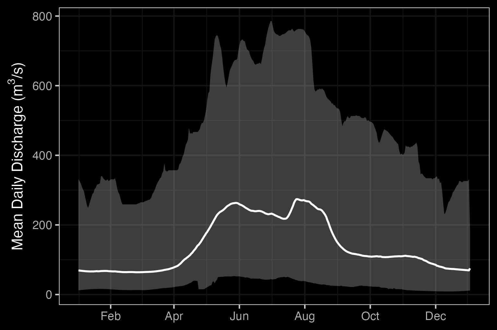
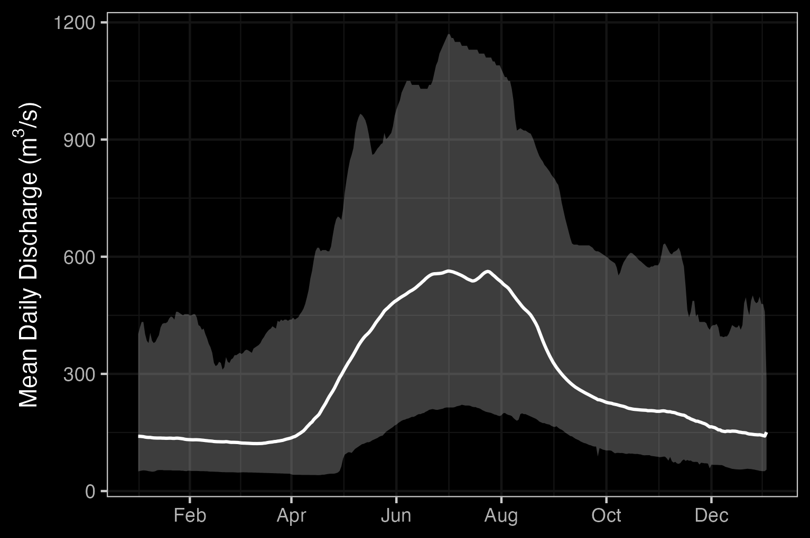
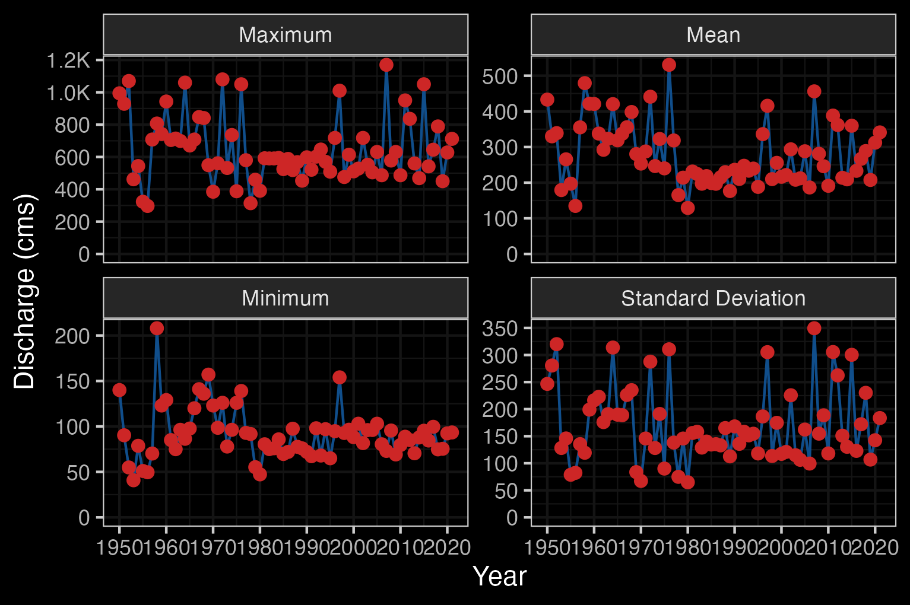
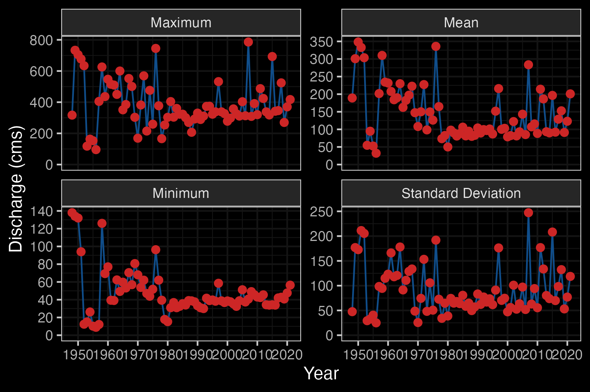
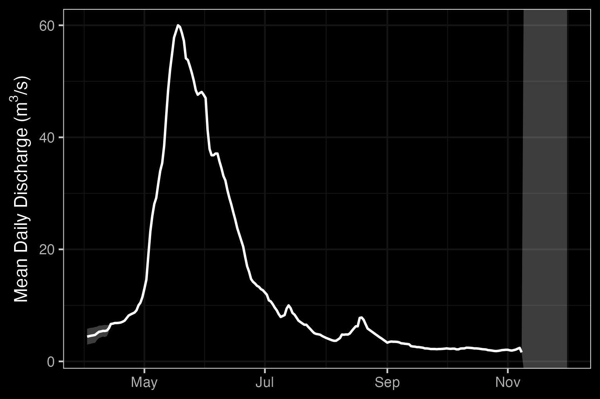
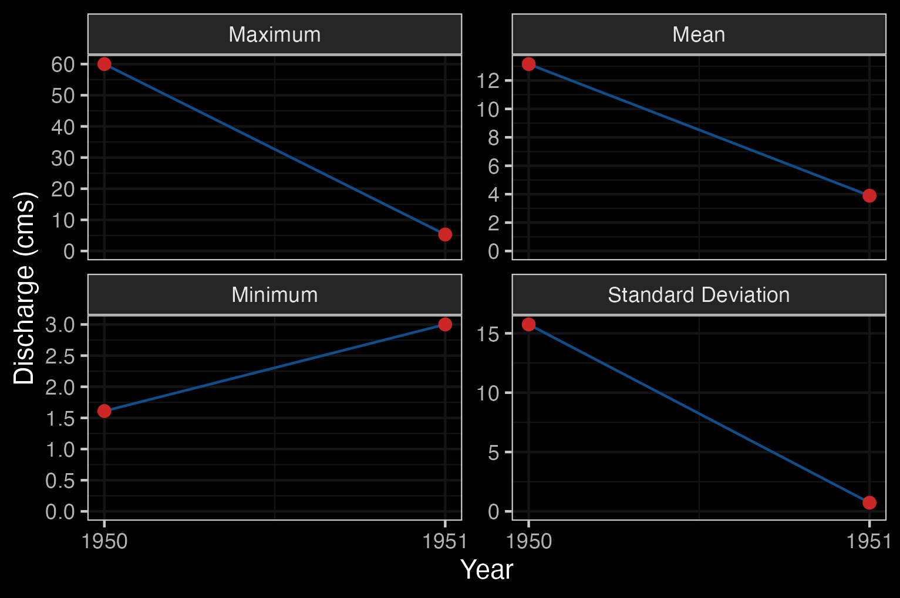
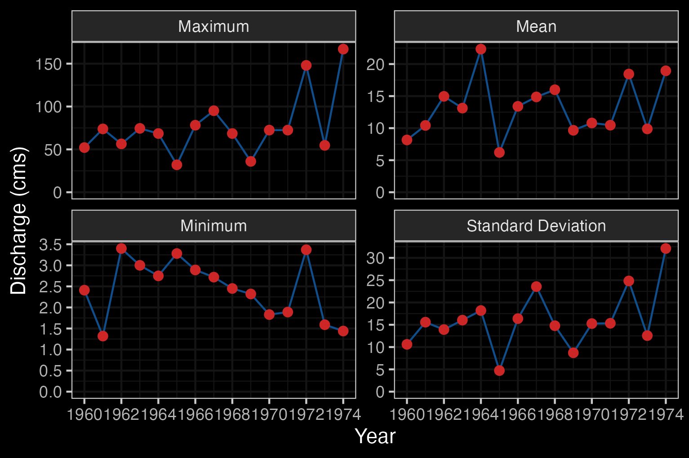

# Background

## Project Location

<!-- The simpc qgis project includes a lot of watershed groups/big area but looks like the 2023 assessments were only in 2 of the watershed groups (see below). Should we include all the watershed groups in the report or just the ones we did assessments in? -->

<!-- simpcw watersheds with 2023 assessments: -->
<!-- - upper fraser river (UFRA) -->
<!-- - Morkill River (MORK), not sure if we want to include this one because we didn't actually have any sites on this river. Most sites were small tribs to the fraser. -->

<!-- For now, I have just added info about the watershed groups in which we had 2023 assessments -->


This study area includes the Nechako River, Chilako River, François Lake, and Upper Fraser River watershed groups and is within the traditional territories of the Dakelh (Carrier) and Simpcw.


```{r overview-map, fig.cap = 'Overview map of Study Areas',eval=T}
knitr::include_graphics("fig/nge-icon_name.png")
```

## Lhtakoh

Known as the Lhtakoh, meaning "rivers within one another" to the Dakelh (Carrier) people, the Fraser River stretches nearly 1,400 kilometers from the Rocky Mountains of Mount Robson Provincial Park to the Strait of Georgia near Vancouver. As the largest salmon-producing river on Canada's west coast [@bradford_taylor2023Diversityfreshwater; @DaklehPlacenames], it plays a crucial economic role in supporting forestry, agriculture, and hydroelectric power generation. Additionally, the Fraser River is vital for fisheries, especially for salmon populations, which are essential to both the local ecosystem and Indigenous communities.

<br>

The Upper Fraser River is commonly defined as the section of the mainstem north of Quesnel, flowing through the Cariboo and Fraser Plateau regions. Major tributaries include the Nechako, Quesnel, and McGregor rivers [@shaw_tuominenWaterQuality]. This vast expanse supports many Indigenous groups who utilize the land for cultural, spiritual, and economic practices. Among these groups are the Simpcw First Nation, occupying the North Thomposon area, and the Carrier Sekani Tribal Council which unifies six nations west of Price George: the Ts’il Kaz Koh First Nation (Burns Lake Band), Nadleh Whut’en First Nation, Saik’uz First Nation, Stellat’en First Nation, Takla Nation, and Wet’suwet’en First Nation [@CSTCCSFNs; @SimpcwFirstNationHistory]

<br>

The Upper Fraser River, an 8th order stream, drains an area of 232,134 km^2^ upstream of the McGregor River confluence. The seasonal hydrograph has a single broad peak in early summer due to snow and glacial melt from surrounding mountain ranges (Figures \@ref(fig:hydrograph1) - \@ref(fig:hydrology-stats1)). The mean annual discharge at station 08KA005 in McBride, located roughly 200km southeast of Price George, is `r round(fasstr::calc_longterm_mean(station_number = "08KA005")$LTMAD,1)` m^3^/.

<!-- - FR in McBride, station 08KA005 -->
```{r mcbride-hydat, eval=F}
lfpr_create_hydrograph("08KA005")
```

```{r hydrograph1, fig.cap = "Fraser River At Mcbride (Station #08KA005 - Lat 53.30172 Lon -120.14092). Available mean daily discharge data from 1953 to 2021. "}
knitr::include_graphics("fig/hydrograph_08KA005.png")
```

```{r hydrology-stats1, fig.cap = "Fraser River At Mcbride (Station #08KA005 - Lat 53.30172 Lon -120.14092). Available daily discharge data from 1953 to 2021. "}
knitr::include_graphics("fig/hydrology_stats_08KA005.png")
```


<!-- Other available nearby stations: -->

<!-- - FR in Hansard, upstream of McGregor river confluence, station 08KA004 -->
```{r hansard-hydat, eval=F}
lfpr_create_hydrograph("08KA004")
```

<!-- - FR in Price George, just downstream of Nechako confluence, station 08KE018. It looks like its active (https://wateroffice.ec.gc.ca/report/real_time_e.html?stn=08KE018&mode=Graph&startDate=2024-07-12&endDate=2024-07-19&prm1=46&prm2=3) but tidyhydat only pulls data from 1984 -->

```{r pg-hydat, eval=F}
tidyhydat::hy_daily_flows(station_number = "08KE018")
lfpr_create_hydrograph("08KE018")
```


## Morkill River

<!-- Unsure if we want to include this one, see note above.  -->

<!-- - hydat station on Morkill river, station 08KA013 -->
```{r morkill-hydat, eval=F}
lfpr_create_hydrograph("08KA013")
```

## Nechakoh

The Nechako River, meaning "Blackwater people's river", is home to the Cheslatta Carrier Nation who are part of the Dakelh people. Traditionally, they lived off the land near Tsetl'adak Bunk'ut "Peak Rock Lake" (Cheslatta Lake), however, in 1952, the construction of the Kenney Dam by the Aluminum Company of Canada (Alcan) and the subsequent flooding of the Nechako Reservoir forced the Cheslatta Carrier people to abandon their ancestral lands [@HistoryCheslattaCarrierNation; @DaklehPlacenames]. This relocation was done with little notice or compensation, causing significant disruptions to their community, culture, and way of life. Despite these challenges, the Cheslatta Carrier Nation has worked to preserve their cultural heritage and advocate for their rights and land restoration.

<br>

The Nechako River is an 8th order stream that drains an area of `r fwapgr::fwa_watershed_at_measure(356362759) %>% mutate(area_km2 = round(area_ha/100, 1)) %>% mutate(area_km2 = ifelse(area_km2 >= 1000, format(area_km2, big.mark = ",", scientific = FALSE), area_km2)) %>% pull(area_km2)` km^2^. Beginning at the Nechako Plateau, it flows north towards Fort Fraser then east to its confluence with the Fraser River in Prince George. The Nachako River has three main tributaries: the Stuart River, the Endako River, and the Chilako River. It has a mean annual discharge of `r round(fasstr::calc_longterm_mean(station_number = "08JC001")$LTMAD,1)` m^3^/s at station 08JC001 located in Vanderhoof and `r round(fasstr::calc_longterm_mean(station_number = "08JC002")$LTMAD,1)` m^3^/s at station 08JC002 located in Isle Pierre, \~25km downstream of the Stuart River confluence. Flow patterns at Isle Pierre are heavily influenced by inflows from the Stuart River (enters downstream of Vanderhoof) resulting in higher peak levels and average discharge (Figures \@ref(fig:hydrology-plots2) - \@ref(fig:hydrology-stats2)). The hygrograph at station 08JC001 in Vanderhoof peaks in June and August, with lower peak levels and average discharge (Figures \@ref(fig:hydrology-plots2) - \@ref(fig:hydrology-stats3)).


```{r, eval=FALSE}
hydat_stations <- fpr::fpr_db_query(query = lfpr_dbq_clip('whse_environmental_monitoring.envcan_hydrometric_stn_sp',
'whse_basemapping.fwa_watershed_groups_poly', 'watershed_group_code', c("FRAN", "LCHL","NECR")))
```

```{r, eval= FALSE}
# Use if you want to create a hydrograph for a each station, won't print captions though
hydat_stations %>% 
  dplyr::filter(station_operating_status == "ACTIVE-REALTIME") %>% 
  dplyr::filter(!(station_number == '08JB007')) %>% 
  pull(station_number) %>%
  lapply(fpr_create_hydrograph_local)

```


```{r, eval=TRUE}
# starting at 1948 because that's where consistent data starts
lfpr_create_hydrograph("08JC001", start_year = 1948)
```

```{r, eval=TRUE}
lfpr_create_hydrograph("08JC002")
```

```{r hydrology-plots2, fig.cap = 'Hydrograph for Nechako River at Vanderhoof (Station #08JC001) and at Isle Pierre (Station #08JC002).', fig.show="hold", out.width= c("49.5%","1%","49.5%"), eval=T}

knitr::include_graphics("fig/pixel.png")

```

```{r hydrology-stats2, fig.cap = "Nechako River At Isle Pierre (Station #08JC002 - Lat 53.96044 Lon -123.23486). Available daily discharge data from 1950 to 2022."}

```

```{r hydrology-stats3, fig.cap = "Nechako River At Vanderhoof (Station #08JC001 - Lat 54.02673 Lon -124.00865). Available daily discharge data from 1948 to 2021."}

```


## Endako River

The Endako River is a 6th order stream that flows south east from Burns Lake to Fraser Lake. It drains an area of `r fwapgr::fwa_watershed_at_measure(356361442) %>% mutate(area_km2 = round(area_ha/100, 1)) %>% mutate(area_km2 = ifelse(area_km2 >= 1000, format(area_km2, big.mark = ",", scientific = FALSE), area_km2)) %>% pull(area_km2)` km^2^. There is one hydrometric station on the Endako River located in Endako, but it was only active for one year during 1951. Given the one year of data, the mean annual discharge is `r round(fasstr::calc_longterm_mean(station_number = "08JB004")$LTMAD,1)` m^3^/s at station 08JB004. The hydrograph peaks in May-June (Figures \@ref(fig:hydrograph3)).

```{r, eval=FALSE}
lfpr_create_hydrograph("08JB004")
```

```{r hydrograph3, fig.cap = "Endako River At Endako (Station #08JB004 - Lat 54.08194 Lon -125.021111). Available mean daily discharge data from 1950 to 1951."}

```

```{r hydrology-stats4, fig.cap = "Endako River At Endako (Station #08JB004 - Lat 54.08194 Lon -125.021111). Available daily discharge data from 1950 to 1951.", eval=FALSE}

```

## 	Tsalakoh

The Chilako River, known as the Tsalakoh by the Dakelh people, translates to the "beaver paw river". The Chilako River is a 6th order stream that flows north from the Nechako Plateau to the Nechako River and drains an area of `r fwapgr::fwa_watershed_at_measure(356363121) %>% mutate(area_km2 = round(area_ha/100, 1)) %>% mutate(area_km2 = ifelse(area_km2 >= 1000, format(area_km2, big.mark = ",", scientific = FALSE), area_km2)) %>% pull(area_km2)` km^2^. There is one hydrometric station on the Chilako River located ~10km upstream of the mouth, but it was only active from 1960-1974. Given this data, the hydrograph peaks in May-June (Figures \@ref(fig:hydrograph4) - \@ref(fig:hydrology-stats5)).

```{r, eval=FALSE}
lfpr_create_hydrograph("08JC005")
```

```{r hydrograph4, fig.cap = "Chilako River Near Prince George (Station #08JC005 - Lat 53.808891 Lon -122.988892). Available mean daily discharge data from 1960 to 1974."}
knitr::include_graphics("fig/hydrograph_08JC005.png")
```

```{r hydrology-stats5, fig.cap = "Chilako River Near Prince George (Station #08JC005 - Lat 53.808891 Lon -122.988892). Available daily discharge data from 1960 to 1974."}

```


## Fisheries

### Salmon Stock Assessment Data

Fisheries and Oceans Canada stock assessment data was accessed via the [NuSEDS-New Salmon Escapement Database System](https://open.canada.ca/data/en/dataset/c48669a3-045b-400d-b730-48aafe8c5ee6)
through the [Open Government Portal](https://open.canada.ca/en) with results presented `r if(gitbook_on){knitr::asis_output("in Table \\@ref(tab:stock-assess-dat-all)")}else(knitr::asis_output("[here](https://www.newgraphenvironment.com/fish_passage_skeena_2023_reporting/background.html)"))`. A brief memo on the data extraction process is available [here](http://htmlpreview.github.io/?https://github.com/NewGraphEnvironment/restoration_wedzin_kwa_2024/blob/main/memos/dfo_stock_assess.html).

```{r stock-assess-download, eval=FALSE}
library("ckanr")

# set up the connection to the data portal
ckanr_setup(url = "https://open.canada.ca/data/en")

all_area_nuseds <- ckan_fetch("https://api-proxy.edh.azure.cloud.dfo-mpo.gc.ca/catalogue/records/c48669a3-045b-400d-b730-48aafe8c5ee6/attachments/All%20Areas%20NuSEDS_20240627.xlsx") 

## Since the study area for this project is massive, I tried using the area codes to filter the results instead of 
## using each gazette name (u can find area codes here  https://open.canada.ca/data/en/dataset/c48669a3-045b-400d-b730-48aafe8c5ee6/resource/6200a6a0-690f-3bfa-a55d-9183df47a2fa). We are still left with 9580 results... we may to just use gazette names i guess. 

# area_codes <- c("29I", "29J")
# 
# # filter for our area of interest by area number
# sample_study_area <- all_area_nuseds %>%
#   janitor::clean_names() %>%
#   dplyr::filter(area %in% area_codes)


## Gazette name approach. Did my best to add all the gazette names but I'm sure I missed some so please add any missing ones! I used the watershed groups from the GIS project to get the names. Only ~1500 entries, better than 9500.

## If we filter by gazette name we get more broad results, or we can filter by waterbody but this means we need to sort through the waterbodies for each gazette name and choose the ones we want which is going to take some work, so just filtered by gazette name for now. I can totally sort through the waterbodies to refine the results but I may not be the best person for that job because I don't know the area too well, but can look into it!

waterbodies <- ("NECHAKO|CHILAKO|ENDAKO|FRANÇOIS LAKE|FRASER RIVER|SOUTH THOMPSON RIVER|NORTH THOMPSON RIVER|ADAMS RIVER|MORKILL RIVER|	
CLEARWATER RIVER")

# # filter for our area of interest
sample_study_area <- all_area_nuseds %>%
  janitor::clean_names() %>%
  dplyr::filter(stringr::str_detect(gazetted_name, waterbodies))


## Burn to csv. Updated name so it's clear this contains only the study area waterbodies.
sample_study_area %>% 
  readr::write_csv('data/inputs_raw/study_area_NuSEDS.csv')


```


```{r stock-assess-dat-all, results="asis", echo=FALSE, eval= gitbook_on}

my_caption <- "Fisheries and Oceans Canada stock assessment data for select watershed groups in the Fraser watershed.  Data can be filtered to specific waterbodies, columns can be dragged to reorder and filtered/reordered table can be exported to csv/excel."

# not the results="asis", echo=FALSE in the chunk header
ltab_caption()

dfo_sad_tr <- readr::read_csv('data/inputs_raw/study_area_NuSEDS.csv') %>% 
  # filtering by total_return_to_river doesn't lose any data so lets keep it for this case (it removed data after 19)
  # dplyr::filter(!is.na(total_return_to_river)) %>%
  arrange(species, analysis_yr) %>% 
  dplyr::select(waterbody,
                species, 
                analysis_yr, 
                total_return_to_river, 
                start_spawn_dt_from,
                peak_spawn_dt_from,
                end_spawn_dt_from, 
                accuracy,	
                precision,	
                index_yn,	
                # no data here
                # reliability,	
                estimate_stage,	
                estimate_classification,	
                no_inspections_used,	
                estimate_method) |> 
  janitor::clean_names(case = "title") 

dfo_sad_tr |> 
  my_dt_table()

```

### Fish Species

Certain species (Sockeye, Coho) only have conservation data for sub-populations, so for example Sockeye says it has no cosewic classification which may seem odd to the reader. We can add in the sub-populations so its more informative but I need to look into which sub populations to include. Too bad the` whse_fish.fiss_fish_obsrvtn_pnt_sp` layer doesn't recognize sub populations... just says Sockeye (general)

```{r fiss-species-table}
fiss_species_table <- readr::read_csv('data/inputs_extracted/fiss_species_table.csv')

fiss_species_table %>% 
  fpr::fpr_kable(caption_text = 'Fish species recorded in the Upper Fraser River, Nechako River, Lower Chilako River, and François Lake watershed groups.', 
                 footnote_text = 'COSEWIC abbreviations : 
                 SC - Special concern 
                 DD - Data deficient
                 NAR - Not at risk
                 E - Endangered
                 T - Threatened
                 
                 BC List definitions : 
                 Yellow - Species that is apparently secure 
                 Blue - Species that is of special concern
                 Exotic - Species that have been moved beyond their natural range as a result of human activity
                 ',
                 scroll = gitbook_on)
```
