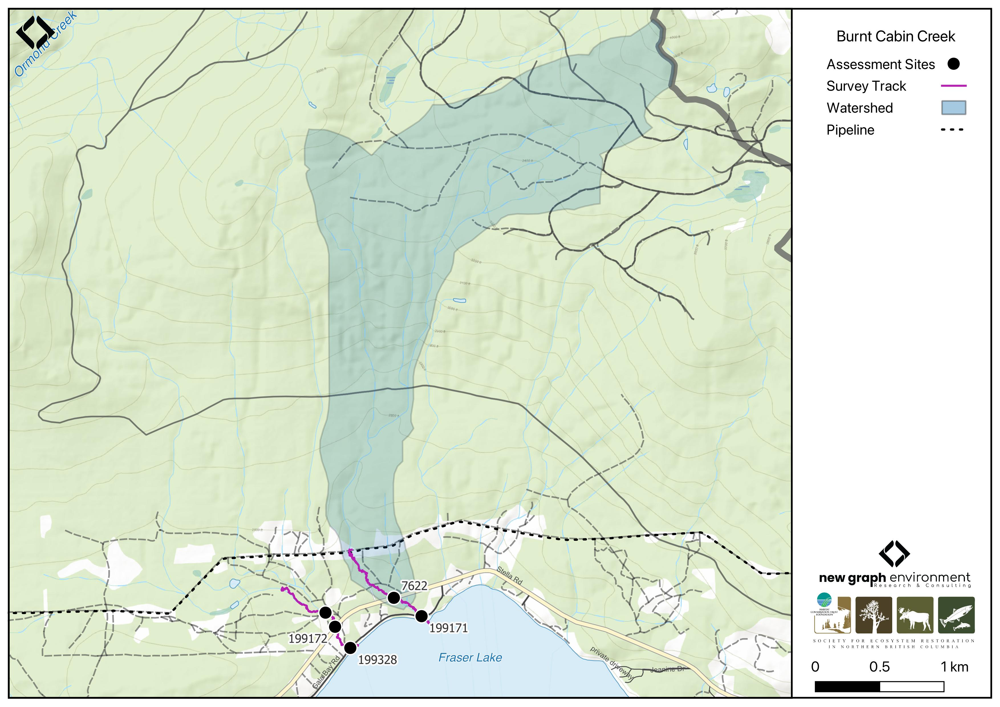

```{r setup-199171, eval = F}
knitr::opts_chunk$set(echo=FALSE, message=FALSE, warning=FALSE)
source('scripts/packages.R')
source('scripts/tables.R')
source('scripts/functions.R')
```

```{r  load-data-199171}
my_site <- 199171
my_site2 <- 7622
```

`r fpr::fpr_appendix_title(site2 = my_site2)`


## Site Location {.unnumbered}

PSCIS crossings `r as.character(my_site)` and `r as.character(my_site2)` are located on `r fpr::fpr_my_pscis_info()`, approximately 8km northwest of the Nadleh Whut'en First Nations community, on the northern side of Fraser Lake, BC (Figure \@ref(fig:map-199171)). Crossing `r as.character(my_site)` is located 50m upstream of Fraser Lake, on `r fpr_my_pscis_info(col_pull = road_name, site = my_site)`, and is the responsibility of the Ministry of Transportation and Infrastructure (chris_culvert_id: 1790951). Approximately 275m further upstream, PSCIS crossing `r as.character(my_site2)` is located on `r fpr_my_pscis_info(col_pull = road_name, site = my_site2)` and is the responsibility of the Ministry of Transportation and Infrastructure (chris_culvert_id: 1794196). Both crossings are within the Francois Lake watershed group. 

<br>

```{r map-199171, fig.cap = my_caption}
 my_caption <- "Map of Burnt Cabin Creek"
 
 
 
```


## Background {.unnumbered}

At the location of these crossings, `r fpr::fpr_my_pscis_info()` is a
`r fpr::fpr_my_bcfishpass() |>english::ordinal()` order stream and drains a watershed of approximately
`r fpr::fpr_my_wshd()`km^2^. The watershed ranges in elevation from
a maximum of `r fpr::fpr_my_wshd(col = 'elev_max')`m to
`r fpr::fpr_my_wshd(col = 'elev_site')`m near the lower crossing (Table
\@ref(tab:tab-wshd-199171)).

<br>

PSCIS crossing `r as.character(my_site2)` was first assessed with a fish passage assessment in 2004 [@moe2023PSCISAssessments]. Both crossings `r as.character(my_site)` and `r as.character(my_site2)` were reassessed in 2023 and prioritized for follow-up due to the presence of high-value habitat and historical reports of sockeye spotted along the shoreline by the adjacent landowner. A habitat confirmation assessment encompassing both sites was conducted in 2024. No fisheries information is documented for the stream; however, downstream in Fraser Lake, white sturgeon, rainbow trout, kokanee, sockeye salmon, chinook salmon, bull trout, dolly varden, and other species have been previously recorded [@norris2024smnorrisbcfishobs; @moe2024KnownBC].

<br>

<!-- A summary of habitat modelling outputs for the crossing are presented in Table -->
<!-- \@ref(tab:tab-culvert-bcfp-199171). -->

<!-- <br> -->

```{r tab-wshd-199171, eval = T}
fpr::fpr_table_wshd_sum(site_id = my_site) |>
  fpr::fpr_kable(caption_text = paste0('Summary of derived upstream watershed statistics for PSCIS crossing ', my_site, '.'),
           footnote_text = 'Elev P60 = Elevation at which 60% of the watershed area is above',
           scroll = F)

```


```{r tab-culvert-bcfp-199171, eval = F}
fpr::fpr_table_bcfp(scroll = gitbook_on) 
```

<br>


## Stream Characteristics at Crossings `r as.character(my_site)` and `r as.character(my_site2)`  {.unnumbered}

At the time of the 2024 assessment, both PSCIS crossings `r as.character(my_site)` and `r as.character(my_site2)` were un-embedded, non-backwatered and ranked as a `r fpr::fpr_my_pscis_info(col_pull = barrier_result) |>stringr::str_to_lower()` to upstream fish passage according to the provincial protocol [@moe2011Fieldassessment] (Tables \@ref(tab:tab-culvert-199171) - \@ref(tab:tab-culvert-7622)). Crossing `r as.character(my_site)` had a 0.9m outlet drop, while crossing `r as.character(my_site2)` had an even larger 1.15m outlet drop.

<br>

At all crossings, the water temperature was `r fpr::fpr_my_habitat_info(loc = "ds", col_pull = 'temperature_c')`$^\circ$C,
pH was `r fpr::fpr_my_habitat_info(loc = "ds", col_pull = 'p_h')` and
conductivity was `r fpr::fpr_my_habitat_info(loc = "ds", col_pull = 'conductivity_m_s_cm')` uS/cm.

`r if(identical(gitbook_on, FALSE)){knitr::asis_output("\\pagebreak")}`

<br>

```{r tab-culvert-199171, eval = T}
fpr::fpr_table_cv_summary_memo()

```

<br>

```{r tab-culvert-7622, eval = T}
fpr::fpr_table_cv_summary_memo(site = my_site2, site_photo_id = my_site2)

```


<br>

```{r eval=F}
##this is useful to get some comments for the report
hab_site |>filter(site == my_site & location == 'ds') |>pull(comments)
hab_site |>filter(site == my_site & location == 'us') |>pull(comments)
hab_site |>filter(site == my_site2 & location == 'us') |>pull(comments)

```


## Stream Characteristics Downstream of Crossing `r as.character(my_site)` {.unnumbered}

`r fpr_my_survey_dist(loc = 'ds')` `r if(gitbook_on){knitr::asis_output("(Figure \\@ref(fig:photo-199171-01)).")}else(knitr::asis_output("(Figure \\@ref(fig:photo-199171-d01))."))` The stream was highly channelized due to residential properties on both sides. The habitat was rated as `r fpr::fpr_my_priority_info(loc = 'ds') |>stringr::str_to_lower()` with minimal cover and few pools suitable for fish, but gravels were present for spawning. Anecdotal information from a neighboring landowner suggested the stream below Gala Bay Road had been diverted to accommodate a driveway for a recreational property. `r fpr_my_habitat_paragraph(loc = 'ds')`

<br>

## Stream Characteristics Upstream of Crossing `r as.character(my_site)` and Downstream of Crossing `r as.character(my_site2)` {.unnumbered}

`r fpr_my_survey_dist(loc = 'us')`, all the way to crossing `r as.character(my_site2)` on `r fpr_my_pscis_info(col_pull = road_name, site = my_site2)` `r if(gitbook_on){knitr::asis_output("(Figure \\@ref(fig:photo-199171-02)).")}else(knitr::asis_output("(Figure \\@ref(fig:photo-199171-d01)"))` The habitat was rated as `r fpr::fpr_my_priority_info(loc = 'us') |>stringr::str_to_lower()` value, with good flow and abundant gravels, flowing through several private properties with newly established quad and foot traffic trails. Pools were limited and predominantly shallow. `r fpr_my_habitat_paragraph(loc = 'us')`

<br>


## Stream Characteristics Upstream of Crossing `r as.character(my_site2)` {.unnumbered}

`r fpr_my_survey_dist(sit = my_site2, loc = 'us')` `r if(gitbook_on){knitr::asis_output("(Figure \\@ref(fig:photo-7622-01)).")}else(knitr::asis_output("(Figure \\@ref(fig:photo-7622-d01))."))` The habitat was rated as `r fpr::fpr_my_priority_info(sit = my_site2, loc = 'us') |>stringr::str_to_lower()` value with relatively steep gradients and abundant functional large woody debris creating steps and pools 20–30mm deep. In some sections, the stream widened and became shallow, with abundant gravels suitable for spawning. Overhead cover was extensive. Near the upper end of the site, the forest had been cleared for pipeline use, resulting in significant bank erosion and ripirian removal `r if(gitbook_on){knitr::asis_output("(Figure \\@ref(fig:photo-7622-02)).")}else(knitr::asis_output("(Figure \\@ref(fig:photo-7622-d01))."))` `r fpr_my_habitat_paragraph(sit = my_site2, loc = 'us')`

<br>

## Aerial Imagery {.unnumbered}

An aerial survey was conducted with a remotely piloted aircraft and the resulting imagery was processed into an orthomosaic available to view and download `r if(gitbook_on){knitr::asis_output("in Figure \\@ref(fig:uav-ortho-199171)")}else(knitr::asis_output("[here](https://viewer.a11s.one/?cog=https://imagery-uav-bc.s3.amazonaws.com/fraser/nechacko/2024/199171_burnt_cabin_gala/odm_orthophoto/odm_orthophoto.tif)"))`.

<br>

```{r uav-ortho-199171-prep, eval = gitbook_on}
viewer_url <- '<iframe src="https://viewer.a11s.one/?cog=https://imagery-uav-bc.s3.amazonaws.com/fraser/nechacko/2024/199171_burnt_cabin_gala/odm_orthophoto/odm_orthophoto.tif" scrolling="no" title="UAV Viewer" width="100%" height="600" frameBorder="0"></iframe>'

knitr::asis_output(viewer_url)
```

```{r uav-ortho-199171, out.width = "0.01%", eval = gitbook_on, fig.cap= my_caption}
my_photo = 'fig/pixel.png'

my_caption = paste0('Orthomosaic of PSCIS crossing ', my_site, '.')

knitr::include_graphics(my_photo, dpi = NA)
```

`r if(gitbook_on){knitr::asis_output("<br>")}`
 

## Structure Remediation and Cost Estimate {.unnumbered}

Should restoration/maintenance activities proceed, replacement of the `r fpr_my_pscis_info(col_pull = road_name, site = my_site)` crossing (`r as.character(my_site)`) with a bridge (`r fpr::fpr_my_pscis_info(site = my_site, col_pull = recommended_diameter_or_span_meters)` m span) is recommended. This culvert had a 0.9m outlet drop, likely inhibiting fish passage.  At the time of reporting in 2025, the cost of the work is estimated at \$ `r format(fpr::fpr_my_cost_estimate(), big.mark = ',')`.

<br>

Should restoration/maintenance activities proceed, replacement of the `r fpr_my_pscis_info(col_pull = road_name, site = my_site2)` crossing (`r as.character(my_site2)`) with a bridge (`r fpr::fpr_my_pscis_info(site = my_site2, col_pull = recommended_diameter_or_span_meters)` m span) is recommended. This culvert had a 1.15m outlet drop, very likely inhibiting fish passage. At the time of reporting in 2025, the cost of the work is estimated at \$ `r format(fpr::fpr_my_cost_estimate(site = my_site2), big.mark = ',')`.

<br>


## Conclusion {.unnumbered}

`r fpr::fpr_my_pscis_info()` is a small stream that flows into Fraser Lake, with reports of historical sockeye spawning by the adjacent landowner. The downstream crossing on `r fpr_my_pscis_info(col_pull = road_name, site = my_site)` had a 0.9m outlet drop, while the `r fpr_my_pscis_info(col_pull = road_name, site = my_site2)` crossing had an even larger 1.15m outlet drop, both of which are likely inhibiting upstream fish passage. Fish sampling is recommended to determine whether fish are able to ascend past the `r fpr_my_pscis_info(col_pull = road_name, site = my_site)` crossing. Both crossing's are a high priority for replacement.

<br>

```{r tab-habitat-summary-199171, eval = T}
tab_hab_summary |>
  dplyr::filter(Site %in% c(my_site, my_site2)) |> 
  fpr::fpr_kable(caption_text = paste0("Summary of habitat details for PSCIS crossings ", my_site, " and ", my_site2, "."),
                 scroll = F) 

```

<br>

```{r photo-199171-01-prep, eval=T}
my_photo1 = fpr::fpr_photo_pull_by_str(str_to_pull = 'ds_typical_2_')

my_caption1 = paste0('Typical habitat downstream of PSCIS crossing ', my_site, '.')


```

```{r photo-199171-01, fig.cap= my_caption1, out.width = photo_width, eval=gitbook_on}
knitr::include_graphics(my_photo1)
```

<br>

```{r photo-199171-02-prep, eval=T}
my_photo2 = fpr::fpr_photo_pull_by_str(str_to_pull = 'us_typical_2')

my_caption2 = paste0('Typical habitat upstream of PSCIS crossing ', my_site, ' and downstream of PSCIS crossing ', my_site2, '.')


```

```{r photo-199171-02, fig.cap= my_caption2, out.width = photo_width, eval=gitbook_on}
knitr::include_graphics(my_photo2)
```

```{r photo-199171-d01, fig.cap = my_caption, fig.show="hold", out.width= c("49.5%","1%","49.5%"), eval=identical(gitbook_on, FALSE)}
my_caption <- paste0('Left: ', my_caption1, ' Right: ', my_caption2)

knitr::include_graphics(my_photo1)
knitr::include_graphics("fig/pixel.png")
knitr::include_graphics(my_photo2)
```

<br>

```{r photo-7622-01-prep, eval=T}
my_photo1 = fpr::fpr_photo_pull_by_str(site = my_site2, str_to_pull = 'us')

my_caption1 = paste0('Typical habitat upstream of PSCIS crossing ', my_site2, '.')


```

```{r photo-7622-01, fig.cap= my_caption1, out.width = photo_width, eval=gitbook_on}
knitr::include_graphics(my_photo1)
```

<br>

```{r photo-7622-02-prep, eval=T}
my_photo2 = fpr::fpr_photo_pull_by_str(site = my_site2, str_to_pull = 'pipeline')

my_caption2 = paste0('Bank erosion and ripirian removal at the pipeline upstream of crossing ', my_site2, '.')


```

```{r photo-7622-02, fig.cap= my_caption2, out.width = photo_width, eval=gitbook_on}
knitr::include_graphics(my_photo2)
```

```{r photo-7622-d01, fig.cap = my_caption, fig.show="hold", out.width= c("49.5%","1%","49.5%"), eval=identical(gitbook_on, FALSE)}
my_caption <- paste0('Left: ', my_caption1, ' Right: ', my_caption2)

knitr::include_graphics(my_photo1)
knitr::include_graphics("fig/pixel.png")
knitr::include_graphics(my_photo2)
```
