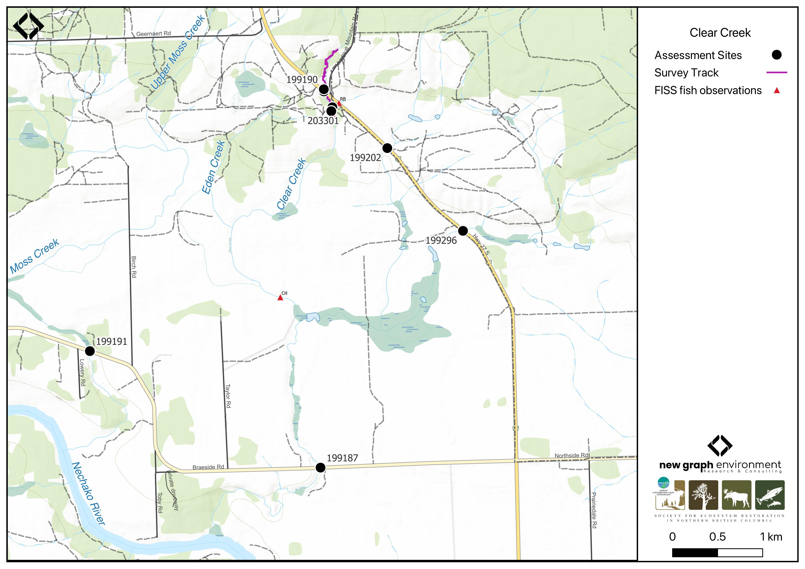

```{r setup-199190, eval = F}
knitr::opts_chunk$set(echo=FALSE, message=FALSE, warning=FALSE)
source('scripts/packages.R')
source('scripts/tables.R')
source('scripts/functions.R')
```

```{r  load-data-199190}
my_site <- 199190
```

`r fpr::fpr_appendix_title()`


## Site Location {.unnumbered}

PSCIS crossing `r as.character(my_site)` is located on `r fpr::fpr_my_pscis_info()`, approximately 19km northwest of Vanderhoof, BC (Figure \@ref(fig:map-199190)). The crossing is located `r round(fpr::fpr_my_bcfishpass(col_pull = downstream_route_measure)*0.001, 1)`km upstream of the Nechako River, on `r fpr_my_pscis_info(col_pull = road_name, site = my_site)`, and is the responsibility of the Ministry of Transportation and Infrastructure (chris_culvert_id: 1806163). The crossing is within the Nechako River watershed group. 

<br>

```{r map-199190, fig.cap = my_caption}
 my_caption <- "Map of Clear Creek"
 
 
 
```

<br>

## Background {.unnumbered}

At PSCIS crossing `r as.character(my_site)`, `r fpr::fpr_my_pscis_info()` is a
`r fpr::fpr_my_bcfishpass() |>english::ordinal()` order stream and drains a watershed of approximately
`r fpr::fpr_my_wshd()`km^2^. The watershed ranges in elevation from
a maximum of `r fpr::fpr_my_wshd(col = 'elev_max')`m to
`r fpr::fpr_my_wshd(col = 'elev_site')`m near the crossing (Table
\@ref(tab:tab-wshd-199190)).

<br>

Since 2020, an ongoing environmental DNA (eDNA) project led by Dr. Brent Murray and Barry Booth at UNBC, in collaboration with School District (SD) 91, has been conducting fish sampling in the Nechako River watershed, including on `r fpr::fpr_my_pscis_info()`. In the lower section of Clear Creek, downstream of Braeside Road, chinook salmon were repeatedly documented through sampling efforts in 2020, 2022, and 2023 [@booth2023SummaryMinnow; @murray_booth2023Report2023]. Upstream of PSCIS crossing 199296, located on a tributary to Clear Creek, coho salmon were detected using eDNA sampling in 2023 [@murray_booth2023Report2023]. Further upstream on Clear Creek, above crossing `r as.character(my_site)` on `r fpr_my_pscis_info(col_pull = road_name, site = my_site)`, `r fpr::fpr_my_fish_sp()` have previously been recorded [@norris2024smnorrisbcfishobs; @moe2024KnownBC].

<br>

Motivated by these findings, and in addition to a historical chinook salmon observation recorded downstream of Highway 27 in the FISS database [@moe2024KnownBC], several crossings within the Clear Creek system were assessed with fish passage assessments in 2023 with results found in [Appendix - Phase 1 Fish Passage Assessment Data and Photos]. 

<br>

Crossing 199187 on Braeside Road was found to be fully backwatered and passable, as well as crossing 199296 located on a tributary to Clear Creek which joins above Braeside Road (Figure \@ref(fig:map-199190)). On the mainstem of Clear Creek, crossing `r as.character(my_site)` on `r fpr_my_pscis_info(col_pull = road_name, site = my_site)` was ranked as a barrier, noted as being in poor condition, and was prioritized for follow-up due to the presence of high-value habitat. A habitat confirmation assessment encompassing crossing `r as.character(my_site)` was subsequently conducted in 2024. 
 
<br>

A summary of habitat modelling outputs for the crossing are presented in Table
\@ref(tab:tab-culvert-bcfp-199190).

<br>

```{r tab-wshd-199190, eval = T}
fpr::fpr_table_wshd_sum(site_id = my_site) |>
  fpr::fpr_kable(caption_text = paste0('Summary of derived upstream watershed statistics for PSCIS crossing ', my_site, '.'),
           footnote_text = 'Elev P60 = Elevation at which 60% of the watershed area is above',
           scroll = F)

```

<br>

```{r tab-culvert-bcfp-199190, eval = T}
fpr::fpr_table_bcfp(scroll = gitbook_on) 
```

<br>


## Stream Characteristics at Crossing `r as.character(my_site)` {.unnumbered}

At the time of the 2024 assessment, PSCIS crossing `r as.character(my_site)` on `r fpr_my_pscis_info(col_pull = road_name, site = my_site)` was un-embedded, non-backwatered and ranked as `r fpr::fpr_my_pscis_info(col_pull = barrier_result) |>stringr::str_to_lower()` to upstream fish passage according to the provincial protocol [@moe2011Fieldassessment] (Table \@ref(tab:tab-culvert-199190)). The culvert had a significant 1m outlet drop and a large pile of riprap placed at the outlet, possibly to reduce the drop, though its placement appeared unusual and may inhibit fish passage.

<br>

The water temperature was `r fpr::fpr_my_habitat_info(loc = "ds", col_pull = 'temperature_c')`$^\circ$C,
pH was `r fpr::fpr_my_habitat_info(loc = "ds", col_pull = 'p_h')` and
conductivity was `r fpr::fpr_my_habitat_info(loc = "ds", col_pull = 'conductivity_m_s_cm')` uS/cm.

`r if(identical(gitbook_on, FALSE)){knitr::asis_output("\\pagebreak")}`

<br>

```{r tab-culvert-199190, eval = T}
fpr::fpr_table_cv_summary_memo()

```


<br>

```{r eval=F}
##this is useful to get some comments for the report
hab_site |>filter(site == my_site & location == 'ds') |>pull(comments)
hab_site |>filter(site == my_site & location == 'us') |>pull(comments)

```


## Stream Characteristics Downstream of Crossing `r as.character(my_site)` {.unnumbered}

`r fpr_my_survey_dist(loc = 'ds')` `r if(gitbook_on){knitr::asis_output("(Figure \\@ref(fig:photo-199190-01)).")}else(knitr::asis_output("(Figure \\@ref(fig:photo-199190-d01))."))` The habitat was rated as `r fpr::fpr_my_priority_info(loc = 'ds') |>stringr::str_to_lower()` value for salmonid spawning an rearing. The stream contained frequent pools suitable for overwintering fish, with abundant cobbles but limited gravels. Evidence of extreme seasonal flows was observed, including large eroding banks, extensive gravel deposits from channel widening (20–30m), and significant log jams.  `r fpr_my_habitat_paragraph(loc = 'ds')`

<br>

## Stream Characteristics Upstream of Crossing `r as.character(my_site)` {.unnumbered}

`r fpr_my_survey_dist(loc = 'us')` `r if(gitbook_on){knitr::asis_output("(Figure \\@ref(fig:photo-199190-02)).")}else(knitr::asis_output("(Figure \\@ref(fig:photo-199190-d01))."))` The habitat was rated as `r fpr::fpr_my_priority_info(loc = 'us') |>stringr::str_to_lower()` value. The stream had good flow and provided high-quality habitat for the first 100m before transitioning to subsurface flow. Approximately 200m upstream of the highway, adjacent to a quarry, the stream was fully dewatered to the top of the surveyed reach. The channel was highly confined, lacked complexity, and consisted primarily of a straight, coarse cobble and boulder substrate. While some small and large woody debris were present, they did not appear to contribute to habitat formation during periods of flow. `r fpr_my_habitat_paragraph(loc = 'us')`

<br>
 

## Structure Remediation and Cost Estimate {.unnumbered}

Should restoration/maintenance activities proceed, replacement of the `r fpr_my_pscis_info(col_pull = road_name)` crossing (`r as.character(my_site)`) with a bridge (`r fpr::fpr_my_pscis_info(col_pull = recommended_diameter_or_span_meters)` m span) is recommended. At the time of reporting in 2025, the cost of the work is estimated at \$ `r format(fpr::fpr_my_cost_estimate(), big.mark = ',')`.

<br>


## Conclusion {.unnumbered}

Although the habitat upstream of `r as.character(my_site)` on `r fpr_my_pscis_info(col_pull = road_name, site = my_site)` was documented as low value for salmonid spawning and rearing, downstream habitat was of high quality, and chinook salmon have been detected downstream as recently as 2023 [@murray_booth2023Report2023]. Given these factors, follow-up fish sampling (electrofishing or eDNA sampling) at the crossing is recommended. The crossing had a significant outlet drop, with a large pile of riprap placed at the outlet, possibly to reduce the drop, though its placement appeared unusual and may inhibit fish passage.


`r if(gitbook_on){knitr::asis_output("<br>")} else knitr::asis_output("\\pagebreak")`

<br>

```{r tab-habitat-summary-199190, eval = T}
tab_hab_summary |>
  dplyr::filter(Site %in% c(my_site)) |> 
  fpr::fpr_kable(caption_text = paste0("Summary of habitat details for PSCIS crossing ", my_site, "."),
                 scroll = F) 

```

`r if(gitbook_on){knitr::asis_output("<br>")} else knitr::asis_output("\\pagebreak")`

```{r photo-199190-01-prep, eval=T}
my_photo1 = fpr::fpr_photo_pull_by_str(str_to_pull = 'ds_typical_1_')

my_caption1 = paste0('Typical habitat downstream of PSCIS crossing ', my_site, '.')


```

```{r photo-199190-01, fig.cap= my_caption1, out.width = photo_width, eval=gitbook_on}
knitr::include_graphics(my_photo1)
```

<br>

```{r photo-199190-02-prep, eval=T}
my_photo2 = fpr::fpr_photo_pull_by_str(str_to_pull = 'us_typical_1_')

my_caption2 = paste0('Typical habitat upstream of PSCIS crossing ', my_site, '.')


```

```{r photo-199190-02, fig.cap= my_caption2, out.width = photo_width, eval=gitbook_on}
knitr::include_graphics(my_photo2)
```

```{r photo-199190-d01, fig.cap = my_caption, fig.show="hold", out.width= c("49.5%","1%","49.5%"), eval=identical(gitbook_on, FALSE)}
my_caption <- paste0('Left: ', my_caption1, ' Right: ', my_caption2)

knitr::include_graphics(my_photo1)
knitr::include_graphics("fig/pixel.png")
knitr::include_graphics(my_photo2)
```
