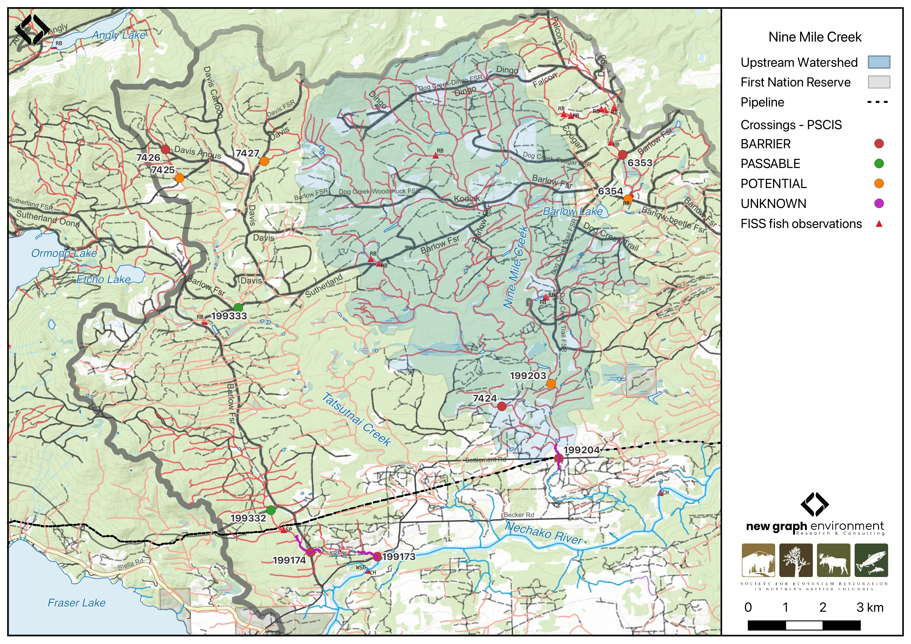

```{r setup-199204, eval = F}
knitr::opts_chunk$set(echo=FALSE, message=FALSE, warning=FALSE)
source('scripts/packages.R')
source('scripts/tables.R')
source('scripts/functions.R')
```

```{r  load-data-199204}
my_site <- 199204
```

`r fpr::fpr_appendix_title()`


## Site Location {.unnumbered}

PSCIS crossing `r as.character(my_site)` is located on `r fpr::fpr_my_pscis_info()`, approximately 11km northeast of the Nadleh Whut'en First Nations community near Fraser Lake, BC, in the Nechako River watershed group (Figure \@ref(fig:map-199204)). The crossing is `r round(fpr::fpr_my_bcfishpass(col_pull = downstream_route_measure)*0.001, 1)`km upstream of the confluence of `r fpr::fpr_my_pscis_info()` and the Nechako River. The crossing is situated on `r fpr_my_pscis_info(col_pull = road_name, site = my_site)`, which is the responsibility of the Ministry of Transportation and Infrastructure (`chris_culvert_id`: `r fpr_my_pscis_info(dat = form_pscis_2024, col_pull = moti_chris_culvert_id, site = my_site)`).

<br>

```{r map-199204, fig.cap = my_caption}
 my_caption <- "Map of Nine Mile Creek"
 
 
 
```

<br>

## Background {.unnumbered}

At PSCIS crossing `r as.character(my_site)`, `r fpr::fpr_my_pscis_info()` is a
`r fpr::fpr_my_bcfishpass() |>english::ordinal()` order stream and drains a watershed of approximately
`r fpr::fpr_my_wshd()`km^2^. The watershed ranges in elevation from
a maximum of `r fpr::fpr_my_wshd(col = 'elev_max')`m to
`r fpr::fpr_my_wshd(col = 'elev_site')`m near the crossing (Table
\@ref(tab:tab-wshd-199204)).

<br>

Since 2020, an ongoing environmental DNA (eDNA) project led by Dr. Brent Murray and Barry Booth at UNBC, in collaboration with School District (SD) 91, has been conducting fish sampling in the Nechako River watershed, including on `r fpr::fpr_my_pscis_info()`.  Minnow trapping by @booth2022SummaryMinnow in 2021 captured chinook just downstream of this crossing but not upstream, despite the presence of suitable habitat. The study suggested that these culverts may be a barrier to further upstream movement of chinook [@booth2022SummaryMinnow]. eDNA results from 2021 showed a strong detection for chinook immediately downstream of the `r fpr_my_pscis_info(col_pull = road_name, site = my_site)` crossing, while 2023 results showed a weaker detection at the same location [@murray_booth2024NEWSSsalmon; @murray_booth2023Report2023]. Additionally, a strong detection for chinook was observed near the confluence of `r fpr::fpr_my_pscis_info()` and the Nechako River in 2023 [@murray_booth2023Report2023].

<br>

Based on these findings, in 2023, crossing `r as.character(my_site)` on `r fpr_my_pscis_info(col_pull = road_name, site = my_site)`  was assessed with a fish passage assessment and prioritized for follow-up due to the presence of high-value habitat. A habitat confirmation assessment was subsequently conducted in 2024. Upstream of the `r fpr_my_pscis_info(col_pull = road_name, site = my_site)`, `r fpr::fpr_my_fish_sp()` have previously been recorded [@norris2024smnorrisbcfishobs; @moe2024KnownBC].

<br>

A summary of habitat modelling outputs for the crossing are presented in Table
\@ref(tab:tab-culvert-bcfp-199204).

<br>


```{r tab-wshd-199204, eval = T}
fpr::fpr_table_wshd_sum(site_id = my_site) |>
  fpr::fpr_kable(caption_text = paste0('Summary of derived upstream watershed statistics for PSCIS crossing ', my_site, '.'),
           footnote_text = 'Elev P60 = Elevation at which 60% of the watershed area is above',
           scroll = F)

```

<br>

```{r tab-culvert-bcfp-199204, eval = T}
fpr::fpr_table_bcfp(scroll = F) 
```

<br>


## Stream Characteristics at Crossing `r as.character(my_site)` {.unnumbered}

At the time of the 2024 assessment, PSCIS crossing `r as.character(my_site)` on `r fpr_my_pscis_info(col_pull = road_name, site = my_site)` was un-embedded, non-backwatered and ranked as `r fpr::fpr_my_pscis_info(col_pull = barrier_result) |>stringr::str_to_lower()` to upstream fish passage according to the provincial protocol [@moe2011Fieldassessment] (Table \@ref(tab:tab-culvert-199204)). Two 1.6m diameter pipes were present, with both inlets dammed by a beaver, causing water to back up to nearly the full height of the culverts. The culverts had a moderate 0.5m outlet drop

<br>

The water temperature was `r fpr::fpr_my_habitat_info(loc = "ds", col_pull = 'temperature_c')`$^\circ$C,
pH was `r fpr::fpr_my_habitat_info(loc = "ds", col_pull = 'p_h')` and
conductivity was `r fpr::fpr_my_habitat_info(loc = "ds", col_pull = 'conductivity_m_s_cm')` uS/cm.


<br>

```{r tab-culvert-199204, eval = T}
# fpr::fpr_table_cv_summary_memo()

# See issue https://github.com/NewGraphEnvironment/mybookdown-template/issues/65
fpr_table_cv_summary_memo_test()
```


<br>

```{r eval=F}
##this is useful to get some comments for the report
hab_site |>filter(site == my_site & location == 'ds') |>pull(comments)
hab_site |>filter(site == my_site & location == 'us') |>pull(comments)

```


## Stream Characteristics Downstream of Crossing `r as.character(my_site)` {.unnumbered}

`r fpr_my_survey_dist(loc = 'ds')` `r if(gitbook_on){knitr::asis_output("(Figure \\@ref(fig:photo-199204-01)).")}else(knitr::asis_output("(Figure \\@ref(fig:photo-199204-d01))."))` The habitat was rated as `r fpr::fpr_my_priority_info(loc = 'ds') |>stringr::str_to_lower()` value, with good stream flow, frequent deep pools suitable for overwintering fish, and abundant spawning gravels. Significant beaver activity was observed, including old and active dams blocking both culverts on Settlement Road. The first 150m showed signs of cattle trampling, with numerous small trails crossing the stream. Approximately 300m downstream of Settlement Road, the stream had been artificially entrenched, creating a large backwatered pool with water pipes leading in, likely related to the adjacent cut block `r if(gitbook_on){knitr::asis_output("(Figure \\@ref(fig:photo-199204-02)).")}else(knitr::asis_output("(Figure \\@ref(fig:photo-199204-d01))."))` Despite modifications, the stream remained well-defined, providing excellent fish habitat. The east side of the stream bordered a cut block with a 30 – 50m buffer zone. One small fish (~40mm) was observed during the survey. `r fpr_my_habitat_paragraph(loc = 'ds')`


<br>

## Stream Characteristics Upstream of Crossing `r as.character(my_site)` {.unnumbered}

`r fpr_my_survey_dist(loc = 'us')` (Figure \@ref(fig:photo-199204-03)). The habitat was rated as `r fpr::fpr_my_priority_info(loc = 'us') |>stringr::str_to_lower()` value for spawning and rearing. The stream was a larger system with significant beaver activity, creating impoundments behind dams ranging from 0.3 - 1.5m in height. Heavy cattle use was evident in riparian areas, with trampled banks, extensive browsing of riparian shrubs, and a significant amount of manure within seasonally inundated areas. Nutrient loading to the stream appeared high, with large amounts of algae present on the primarily gravel substrates in sections of the channel linking beaver-impounded areas. `r fpr_my_habitat_paragraph(loc = 'us')`

<br>
 

## Structure Remediation and Cost Estimate {.unnumbered}

Should restoration/maintenance activities proceed, replacement of the `r fpr_my_pscis_info(col_pull = road_name)` crossing (`r as.character(my_site)`) with a bridge (`r fpr::fpr_my_pscis_info(col_pull = recommended_diameter_or_span_meters)` m span) is recommended. At the time of reporting in 2025, the cost of the work is estimated at \$ `r format(fpr::fpr_my_cost_estimate(), big.mark = ',')`.

<br>


## Conclusion {.unnumbered}

Nine Mile Creek is a tributary to the Nechako River and a known chinook system, with chinook captured immediately downstream of the crossing in 2021 and detected through eDNA sampling as recently as 2023 [@booth2022SummaryMinnow;@murray_booth2023Report2023]. Medium value habitat was observed upstream of the crossing, with `bcfishpass` modeling indicating 8km of potential chinook spawning habitat and 16km of potential coho spawning habitat upstream. Downstream provided excellent fish habitat with good stream flow, frequent deep pools suitable for overwintering fish, and abundant spawning gravels. Beaver activity and heavy cattle use was observed both upstream and downstream of the crossing. The culverts had a moderate outlet drop, and the crossing is a `r stringr::str_to_lower(fpr::fpr_my_priority_info(col_pull = priority))` priority for replacement. Given the species present in the system and the outlet drops at both crossings, fish sampling is recommended to determine whether the culverts are impeding fish passage.


`r if(gitbook_on){knitr::asis_output("<br>")} else knitr::asis_output("\\pagebreak")`

<br>

```{r tab-habitat-summary-199204, eval = T}
tab_hab_summary |>
  dplyr::filter(Site %in% c(my_site)) |> 
  fpr::fpr_kable(caption_text = paste0("Summary of habitat details for PSCIS crossing ", my_site, "."),
                 scroll = F) 

```

`r if(gitbook_on){knitr::asis_output("<br>")} else knitr::asis_output("\\pagebreak")`

```{r photo-199204-01-prep, eval=T}
my_photo1 = fpr::fpr_photo_pull_by_str(str_to_pull = 'ds_typical_2_')

my_caption1 = paste0('Typical habitat downstream of PSCIS crossing ', my_site, '.')


```

```{r photo-199204-01, fig.cap= my_caption1, out.width = photo_width, eval=gitbook_on}
knitr::include_graphics(my_photo1)
```

<br>

```{r photo-199204-02-prep, eval=T}
my_photo2 = fpr::fpr_photo_pull_by_str(str_to_pull = 'trench')

my_caption2 = paste0('Large, artificially entrenched pool located ~300m downstream of PSCIS crossing ', my_site, '.')


```

```{r photo-199204-02, fig.cap= my_caption2, out.width = photo_width, eval=gitbook_on}
knitr::include_graphics(my_photo2)
```

```{r photo-199204-d01, fig.cap = my_caption, fig.show="hold", out.width= c("49.5%","1%","49.5%"), eval=identical(gitbook_on, FALSE)}
my_caption <- paste0('Left: ', my_caption1, ' Right: ', my_caption2)

knitr::include_graphics(my_photo1)
knitr::include_graphics("fig/pixel.png")
knitr::include_graphics(my_photo2)
```

<br>

```{r photo-199204-03-prep, eval=T}
my_photo1 = fpr::fpr_photo_pull_by_str(str_to_pull = 'us_typical_2_')

my_caption1 = paste0('Typical habitat upstream of PSCIS crossing ', my_site, '.')


```

```{r photo-199204-03, fig.cap= my_caption1, out.width = photo_width, eval=T}
knitr::include_graphics(my_photo1)
```
