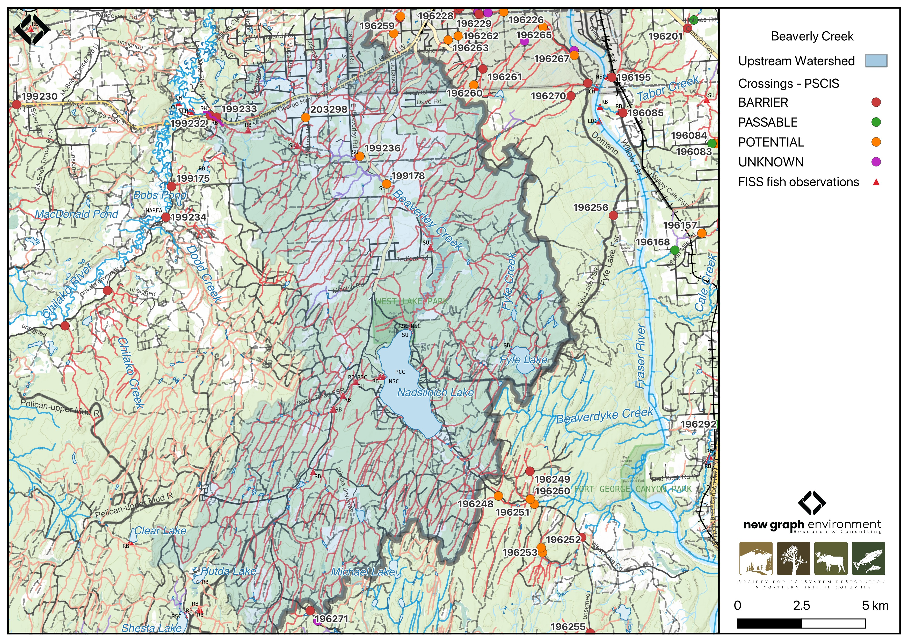

```{r setup-199232, eval = F}
knitr::opts_chunk$set(echo=FALSE, message=FALSE, warning=FALSE)
source('scripts/packages.R')
source('scripts/tables.R')
source('scripts/functions.R')
```

```{r  load-data-199232}
my_site <- 199232
```

`r fpr::fpr_appendix_title()`


## Site Location {.unnumbered}

PSCIS crossing `r as.character(my_site)` is located on `r fpr::fpr_my_pscis_info()`, approximately 14km west of Prince George, BC, in the Lower Chilako River watershed group (Figure \@ref(fig:map-199232)). The crossing is `r round(fpr::fpr_my_bcfishpass(col_pull = downstream_route_measure)*0.001, 1)`km upstream of `r fpr::fpr_my_pscis_info()`'s confluence with the Chilako River, the later of which flows into the Nechako River. It is situated on `r fpr_my_pscis_info(col_pull = road_name, site = my_site)` and falls under the responsibility of the Ministry of Transportation and Infrastructure (`chris_hwy_structure_road_id`: 4167). 

<br>

```{r map-199232, fig.cap = my_caption}
 my_caption <- "Map of Beaverly Creek"
 
 
 
```

<br>

## Background {.unnumbered}

At the location of PSCIS crossing `r as.character(my_site)`, `r fpr::fpr_my_pscis_info()` is a
`r fpr::fpr_my_bcfishpass() |>english::ordinal()` order stream and drains a watershed of approximately
`r fpr::fpr_my_wshd()`km^2^. The watershed ranges in elevation from
a maximum of `r fpr::fpr_my_wshd(col = 'elev_max')`m to
`r fpr::fpr_my_wshd(col = 'elev_site')`m near the crossing (Table
\@ref(tab:tab-wshd-199232)).

<br>

In 2023, PSCIS crossing `r as.character(my_site)` on `r fpr_my_pscis_info(col_pull = road_name, site = my_site)`  was assessed with a fish passage assessment and prioritized for follow-up due to the presence of high-value habitat and several historical chinook observations documented downstream in the FISS database [@moe2024KnownBC]. A habitat confirmation assessment was subsequently conducted in 2024. Several other crossings were assessed within the `r fpr::fpr_my_pscis_info()` system in 2023, with results detailed in `r if(gitbook_on){knitr::asis_output("[Appendix - Phase 1 Fish Passage Assessment Data and Photos]")}else(knitr::asis_output("[Attachment - Phase 1 Data and Photos](#attach-pdf-phase1-dat)"))`.

<br>

Chinook fry were captured downstream of the crossing in 2010 and 2004 by members from Vancouver Island University [@godfreyson2010Scientificfish; @hobson2004Scientificfish]. Upstream of `r fpr_my_pscis_info(col_pull = road_name, site = my_site)`, `r fpr::fpr_my_fish_sp()` have previously been recorded [@norris2024smnorrisbcfishobs; @moe2024KnownBC].

<br>

A summary of habitat modelling outputs for the crossing are presented in Table
\@ref(tab:tab-culvert-bcfp-199232).


<br>

```{r tab-wshd-199232, eval = T}
fpr::fpr_table_wshd_sum(site_id = my_site) |>
  fpr::fpr_kable(caption_text = paste0('Summary of derived upstream watershed statistics for PSCIS crossing ', my_site, '.'),
           footnote_text = 'Elev P60 = Elevation at which 60% of the watershed area is above',
           scroll = F)

```

<br>

```{r tab-culvert-bcfp-199232, eval = T}
fpr::fpr_table_bcfp(scroll = F) 
```

<br>


## Stream Characteristics at Crossing `r as.character(my_site)` {.unnumbered}

At the time of the 2024 assessment, PSCIS crossing `r as.character(my_site)` on `r fpr_my_pscis_info(col_pull = road_name, site = my_site)` was un-embedded, non-backwatered and ranked as `r fpr::fpr_my_pscis_info(col_pull = barrier_result) |>stringr::str_to_lower()` to upstream fish passage according to the provincial protocol [@moe2011Fieldassessment] (Table \@ref(tab:tab-culvert-199232)). Two 2.8m diameter pipes were present, with no flow observed in the more northern pipe. The culverts had a significant 1.05m outlet drop.  

<br>

The water temperature was `r fpr::fpr_my_habitat_info(loc = "ds", col_pull = 'temperature_c')`$^\circ$C,
pH was `r fpr::fpr_my_habitat_info(loc = "ds", col_pull = 'p_h')` and
conductivity was `r fpr::fpr_my_habitat_info(loc = "ds", col_pull = 'conductivity_m_s_cm')` uS/cm.

`r if(identical(gitbook_on, FALSE)){knitr::asis_output("\\pagebreak")}`

<br>

```{r tab-culvert-199232, eval = T}
# fpr::fpr_table_cv_summary_memo()

# See issue https://github.com/NewGraphEnvironment/mybookdown-template/issues/65
fpr::fpr_table_cv_summary_memo()

```


<br>

```{r eval=F}
##this is useful to get some comments for the report
hab_site |>filter(site == my_site & location == 'ds') |>pull(comments)
hab_site |>filter(site == my_site & location == 'us') |>pull(comments)

```


## Stream Characteristics Downstream of Crossing `r as.character(my_site)` {.unnumbered}

`r fpr_my_survey_dist(loc = 'ds')` `r if(gitbook_on){knitr::asis_output("(Figure \\@ref(fig:photo-199232-01)).")}else(knitr::asis_output("(Figure \\@ref(fig:photo-199232-d01))."))` The habitat was rated as `r fpr::fpr_my_priority_info(loc = 'ds') |> stringr::str_to_lower()` value due to sparse large woody debris, a lack of pools, and high turbidity from recent rainfall likely obscuring gravels. Below the outlet, large boulders were placed in rows to backwater the culvert, which was somewhat effective, though the culvert itself remained unbackwatered. This section had a steeper gradient (3 – 4%) before transitioning to ~0.5% for the remainder of the area surveyed. The upper section of the stream was somewhat channelized due to residences on both sides, while lower sections showed significant bank erosion. `r fpr_my_habitat_paragraph(loc = 'ds')`  

<br>

## Stream Characteristics Upstream of Crossing `r as.character(my_site)` {.unnumbered}

`r fpr_my_survey_dist(loc = 'us')` `r if(gitbook_on){knitr::asis_output("(Figure \\@ref(fig:photo-199232-02)).")}else(knitr::asis_output("(Figure \\@ref(fig:photo-199232-d01))."))` The habitat was rated as `r fpr::fpr_my_priority_info(loc = 'us') |> stringr::str_to_lower()` value, with abundant gravels suitable for chinook spawning. Pools were infrequent, primarily located on outside bends and behind large woody debris. Some evidence of anthropogenic manipulation was observed, including cut cottonwood trees that had fallen into the channel. The riparian zone was in good condition, with mature shrub communities and old-growth cottonwood that should contribute to future habitat complexity. Water levels were elevated to moderate conditions due to heavy rainfall over the previous evening and preceding weeks. `r fpr_my_habitat_paragraph(loc = 'us')`  

<br>
 

## Structure Remediation and Cost Estimate {.unnumbered}

Should restoration/maintenance activities proceed, replacement of the `r fpr_my_pscis_info(col_pull = road_name)` crossing (`r as.character(my_site)`) with a bridge (`r fpr::fpr_my_pscis_info(col_pull = recommended_diameter_or_span_meters)` m span) is recommended. At the time of reporting in 2025, the cost of the work is estimated at \$ `r format(fpr::fpr_my_cost_estimate(), big.mark = ',')`.

<br>


## Conclusion {.unnumbered}

`r fpr::fpr_my_pscis_info()` is a large stream and a major tributary to the Chilako River, with documented chinook observations downstream, most recently in 2010 [@godfreyson2010Scientificfish]. The areas surveyed upstream provided high-value habitat for chinook spawning, with `bcfishpass` modeling indicating ~11km of potential chinook and ~47km of potential coho spawning habitat upstream. Both culverts had a significant outlet drop, and the crossing is a `r stringr::str_to_lower(fpr::fpr_my_priority_info(col_pull = priority))` priority for replacement. The watershed is within Prince George city limits, presenting opportunities for community engagement, trail network development, educational programs, and stewardship initiatives.  

`r if(gitbook_on){knitr::asis_output("<br>")} else knitr::asis_output("\\pagebreak")`

<br>

```{r tab-habitat-summary-199232, eval = T}
tab_hab_summary |>
  dplyr::filter(Site %in% c(my_site)) |> 
  fpr::fpr_kable(caption_text = paste0("Summary of habitat details for PSCIS crossing ", my_site, "."),
                 scroll = F) 

```

`r if(gitbook_on){knitr::asis_output("<br>")} else knitr::asis_output("\\pagebreak")`

```{r photo-199232-01-prep, eval=T}
my_photo1 = fpr::fpr_photo_pull_by_str(str_to_pull = 'ds_typical_1_')

my_caption1 = paste0('Typical habitat downstream of PSCIS crossing ', my_site, '.')


```

```{r photo-199232-01, fig.cap= my_caption1, out.width = photo_width, eval=gitbook_on}
knitr::include_graphics(my_photo1)
```

<br>

```{r photo-199232-02-prep, eval=T}
my_photo2 = fpr::fpr_photo_pull_by_str(str_to_pull = 'us_typical_2_')

my_caption2 = paste0('Typical habitat upstream of PSCIS crossing ', my_site, '.')


```

```{r photo-199232-02, fig.cap= my_caption2, out.width = photo_width, eval=gitbook_on}
knitr::include_graphics(my_photo2)
```

```{r photo-199232-d01, fig.cap = my_caption, fig.show="hold", out.width= c("49.5%","1%","49.5%"), eval=identical(gitbook_on, FALSE)}
my_caption <- paste0('Left: ', my_caption1, ' Right: ', my_caption2)

knitr::include_graphics(my_photo1)
knitr::include_graphics("fig/pixel.png")
knitr::include_graphics(my_photo2)
```
