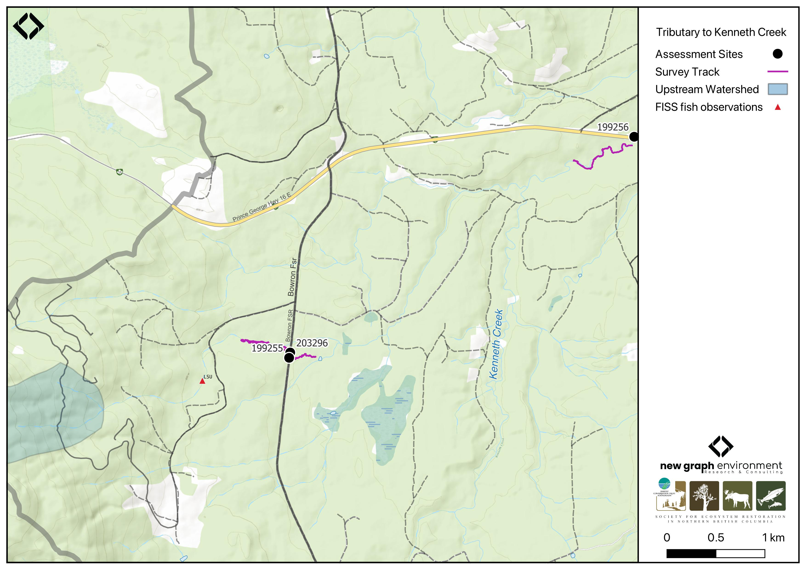

```{r setup-199255, eval = F}
knitr::opts_chunk$set(echo=FALSE, message=FALSE, warning=FALSE)
source('scripts/packages.R')
source('scripts/tables.R')
source('scripts/functions.R')
```

```{r  load-data-199255}
my_site <- 199255
```

`r fpr::fpr_appendix_title()`


## Site Location {.unnumbered}

PSCIS crossing `r as.character(my_site)` is located on a `r fpr::fpr_my_pscis_info()`, approximately 65km east of Prince George, BC, in the Morkill River watershed group (Figure \@ref(fig:map-199255)). The crossing is located 3.7km upstream of the tributary's confluence with Kenneth Creek, which subsequently flows into the Fraser River approximately 9km downstream. The crossing is situated on `r fpr_my_pscis_info(col_pull = road_name, site = my_site)`, which is under the jurisdiction of the Ministry of Forests.

<br>

```{r map-199255, fig.cap = my_caption}
 my_caption <- "Map of Tributary to Kenneth Creek"
 
 
 
```

<br>


## Background {.unnumbered}

At PSCIS crossing `r as.character(my_site)`, `r fpr::fpr_my_pscis_info()` is a
`r fpr::fpr_my_bcfishpass() |>english::ordinal()` order stream and drains a watershed of approximately
`r fpr::fpr_my_wshd()`km^2^. The watershed ranges in elevation from
a maximum of `r fpr::fpr_my_wshd(col = 'elev_max')`m to
`r fpr::fpr_my_wshd(col = 'elev_site')`m near the crossing (Table
\@ref(tab:tab-wshd-199255)). Detailed background information regarding the Kenneth Creek watershed is presented in [Kenneth Creek - 199256 - Appendix]. 

<br>

In 2023, crossing `r as.character(my_site)` on `r fpr_my_pscis_info(col_pull = road_name, site = my_site)`  was assessed with a fish passage assessment and prioritized for follow-up due to the presence of high-value habitat and its proximity to Kenneth Creek, which has chinook observations documented in the FISS database [@moe2024KnownBC]. A habitat confirmation assessment was subsequently conducted in 2024. Upstream of `r fpr_my_pscis_info(col_pull = road_name, site = my_site)`, `r fpr::fpr_my_fish_sp()` have previously been recorded [@norris2024smnorrisbcfishobs; @moe2024KnownBC].

<br>

A summary of habitat modelling outputs for the crossing are presented in Table
\@ref(tab:tab-culvert-bcfp-199255).
<br>

```{r tab-wshd-199255, eval = T}
fpr::fpr_table_wshd_sum(site_id = my_site) |>
  fpr::fpr_kable(caption_text = paste0('Summary of derived upstream watershed statistics for PSCIS crossing ', my_site, '.'),
           footnote_text = 'Elev P60 = Elevation at which 60% of the watershed area is above',
           scroll = F)

```


<br>

```{r tab-culvert-bcfp-199255, eval = T}
fpr::fpr_table_bcfp(scroll = F) 
```

<br>


## Stream Characteristics at Crossing `r as.character(my_site)` {.unnumbered}

At the time of the 2024 assessment, PSCIS crossing `r as.character(my_site)` on `r fpr_my_pscis_info(col_pull = road_name, site = my_site)` was un-embedded, non-backwatered and ranked as `r fpr::fpr_my_pscis_info(col_pull = barrier_result) |>stringr::str_to_lower()` to upstream fish passage according to the provincial protocol [@moe2011Fieldassessment] (Table \@ref(tab:tab-culvert-199255)). The outlet of the culvert was plugged with beaver sticks, and it appeared the beaver had dammed the culvert entirely, creating a large pond area upstream of the inlet with the inlet completely submerged. Despite this, the culvert still had flow. A new culvert had been installed 60m north on the FSR (PSCIS 203296), with flow from that crossing entering the outlet pool from the north.

<br>

The water temperature was `r fpr::fpr_my_habitat_info(loc = "ds", col_pull = 'temperature_c')`$^\circ$C,
pH was `r fpr::fpr_my_habitat_info(loc = "ds", col_pull = 'p_h')` and
conductivity was `r fpr::fpr_my_habitat_info(loc = "ds", col_pull = 'conductivity_m_s_cm')` uS/cm.

`r if(identical(gitbook_on, FALSE)){knitr::asis_output("\\pagebreak")}`

<br>

```{r tab-culvert-199255, eval = T}
# fpr::fpr_table_cv_summary_memo()

# See issue https://github.com/NewGraphEnvironment/mybookdown-template/issues/65
fpr_table_cv_summary_memo_test()

```


<br>

```{r eval=F}
##this is useful to get some comments for the report
hab_site |>filter(site == my_site & location == 'ds') |>pull(comments)
hab_site |>filter(site == my_site & location == 'us') |>pull(comments)

```


## Stream Characteristics Downstream of Crossing `r as.character(my_site)` {.unnumbered}

`r fpr_my_survey_dist(loc = 'ds')` `r if(gitbook_on){knitr::asis_output("(Figure \\@ref(fig:photo-199255-01)).")}else(knitr::asis_output("(Figure \\@ref(fig:photo-199255-d01))."))` The habitat was rated as `r fpr::fpr_my_priority_info(loc = 'ds') |>stringr::str_to_lower()` value for spawning and rearing with no gravels or cobbles observed and the substrate consisting entirely of fine mud. Fish habitat was limited, with very few pools present. The first 130m of the stream was a beaver-affected area, with a beaver dam approximately 0.7m high located ~40m downstream of the culvert. The dam had flooded the surrounding forest, with no main channel observed. Occasional sections had a somewhat defined channel, but the majority of the surveyed area consisted of water flowing through a wet forest.  `r fpr_my_habitat_paragraph(loc = 'ds')`. 

<br>

## Stream Characteristics Upstream of Crossing `r as.character(my_site)` {.unnumbered}

`r fpr_my_survey_dist(loc = 'us')` `r if(gitbook_on){knitr::asis_output("(Figure \\@ref(fig:photo-199255-02)).")}else(knitr::asis_output("(Figure \\@ref(fig:photo-199255-d01))."))` The habitat was rated as `r fpr::fpr_my_priority_info(loc = 'us') |>stringr::str_to_lower()` value with good flow and abundant gravels suitable for bull trout and cutthroat trout spawning. Occasional shallow pools provided habitat for juvenile salmonid rearing. Banks were stable, with an intact mixed mature forest. The stream was small and had some short sections with gradients up to 5% but was primarily a low-gradient riffle-gravel system. `r fpr_my_habitat_paragraph(loc = 'us')`

<br>
 

## Structure Remediation and Cost Estimate {.unnumbered}

Should restoration/maintenance activities proceed, replacement of the `r fpr_my_pscis_info(col_pull = road_name)` crossing (`r as.character(my_site)`) with a bridge (`r fpr::fpr_my_pscis_info(col_pull = recommended_diameter_or_span_meters)` m span) is recommended. At the time of reporting in 2025, the cost of the work is estimated at \$ `r format(fpr::fpr_my_cost_estimate(), big.mark = ',')`.

<br>


## Conclusion {.unnumbered}

Although the culvert ranked as a barrier to upstream fish passage according to the provincial protocol [@moe2011Fieldassessment], blockage due to beaver activity is a greater issue than the culvert itself. The outlet was plugged with beaver sticks, and it appeared the beaver had dammed the culvert entirely, creating a large pond upstream with the inlet completely submerged. Despite this, some flow remained. The habitat surveyed downstream was low value but could change if beaver activity decreased; however, most of the area consisted of water flowing through a wet forest with a substrate of fine mud. Upstream habitat was rated as `r fpr::fpr_my_priority_info(loc = 'us') |> stringr::str_to_lower()` value, with good flow and abundant gravels suitable for bull trout and cutthroat trout spawning, making the crossing a `r stringr::str_to_lower(fpr::fpr_my_priority_info(col_pull = priority))` priority for replacement.


`r if(gitbook_on){knitr::asis_output("<br>")} else knitr::asis_output("\\pagebreak")`

<br>

```{r tab-habitat-summary-199255, eval = T}
tab_hab_summary |>
  dplyr::filter(Site %in% c(my_site)) |> 
  fpr::fpr_kable(caption_text = paste0("Summary of habitat details for PSCIS crossing ", my_site, "."),
                 scroll = F) 

```

`r if(gitbook_on){knitr::asis_output("<br>")} else knitr::asis_output("\\pagebreak")`

```{r photo-199255-01-prep, eval=T}
my_photo1 = fpr::fpr_photo_pull_by_str(str_to_pull = 'ds_typical_1_')

my_caption1 = paste0('Typical habitat downstream of PSCIS crossing ', my_site, '.')


```

```{r photo-199255-01, fig.cap= my_caption1, out.width = photo_width, eval=gitbook_on}
knitr::include_graphics(my_photo1)
```

<br>

```{r photo-199255-02-prep, eval=T}
my_photo2 = fpr::fpr_photo_pull_by_str(str_to_pull = 'us_typical_1_')

my_caption2 = paste0('Typical habitat upstream of PSCIS crossing ', my_site, '.')


```

```{r photo-199255-02, fig.cap= my_caption2, out.width = photo_width, eval=gitbook_on}
knitr::include_graphics(my_photo2)
```

```{r photo-199255-d01, fig.cap = my_caption, fig.show="hold", out.width= c("49.5%","1%","49.5%"), eval=identical(gitbook_on, FALSE)}
my_caption <- paste0('Left: ', my_caption1, ' Right: ', my_caption2)

knitr::include_graphics(my_photo1)
knitr::include_graphics("fig/pixel.png")
knitr::include_graphics(my_photo2)
```
