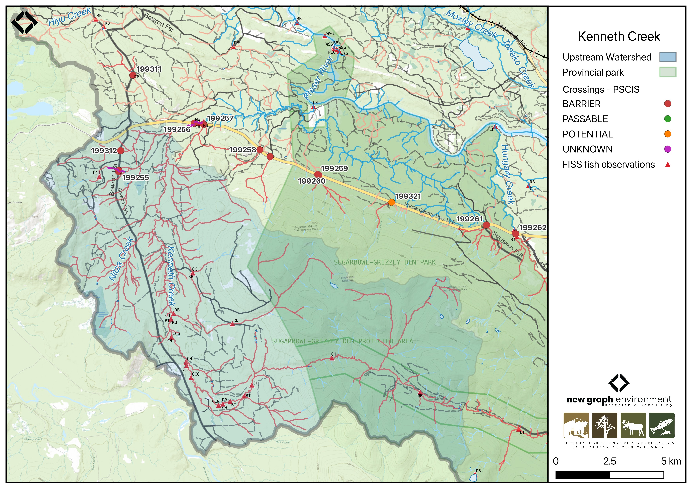

```{r setup-199256, eval = F}
knitr::opts_chunk$set(echo=FALSE, message=FALSE, warning=FALSE)
source('scripts/packages.R')
source('scripts/tables.R')
source('scripts/functions.R')
```

```{r  load-data-199256}
my_site <- 199256
```

`r fpr::fpr_appendix_title()`


## Site Location {.unnumbered}

PSCIS crossing `r as.character(my_site)` is located on `r fpr::fpr_my_pscis_info()`, approximately 80km east of Prince George, BC, in the Morkill River watershed group (Figure \@ref(fig:map-199256)). The crossing is located `r round(fpr::fpr_my_bcfishpass(col_pull = downstream_route_measure)*0.001, 1)`km upstream of the confluence of `r fpr::fpr_my_pscis_info()` and the Fraser River. The crossing is situated on `r fpr_my_pscis_info(col_pull = road_name, site = my_site)`, and is the responsibility of the Ministry of Transportation and Infrastructure (`chris_hwy_structure_road_id`: 3750).

<br>

The headwaters and confluence of `r fpr::fpr_my_pscis_info()` overlap the Sugarbowl-Grizzly Den Provincial Park which is within the traditional territory of the Lheidli T’enneh (Figure \@ref(fig:map-199256)). The park protects a significant area of old-growth interior cedar-hemlock forest, provides high-quality habitat for wildlife, including grizzly bear, marten, and caribou, and serves as an important movement corridor for caribou. Additionally, the area features a trail system that supports popular alpine backcountry recreation opportunities near Prince George [@SugarbowlGrizzlyPark; @SugarbowlGrizzlyCabinsPGBRS].  

<br>

```{r map-199256, fig.cap = my_caption}
 my_caption <- "Map of Kenneth Creek"
 
 
 
```

<br>

## Background {.unnumbered}

At PSCIS crossing `r as.character(my_site)`, `r fpr::fpr_my_pscis_info()` is a
`r fpr::fpr_my_bcfishpass() |>english::ordinal()` order stream and drains a watershed of approximately
`r fpr::fpr_my_wshd()`km^2^. The watershed ranges in elevation from
a maximum of `r fpr::fpr_my_wshd(col = 'elev_max')`m to
`r fpr::fpr_my_wshd(col = 'elev_site')`m near the crossing (Table
\@ref(tab:tab-wshd-199256)). 

<br>

The Kenneth Creek watershed was assessed in detail using Fish Habitat Assessment Procedures (FHAP) in 1997 by AquaFor Consulting Ltd [@aquaforconsultingltd19981997watershed]. Extensive degradation due to past forest harvesting was noted, with much of the watershed lacking future inputs of functional large woody debris—an element critical for maintaining channel and bank stability, diversifying habitat, and reducing stream velocities. Field observations indicated that the lower 15 reaches provide extremely valuable habitat for chinook salmon, and are also important for bull trout and rainbow trout. These reaches were all found to be severely impacted by past harvesting, with the most negative and cumulative impacts occurring where stream crossings were improperly located or poorly deactivated (if at all). @aquaforconsultingltd19981997watershed stated that although impacts varied across reaches, the system is actively degrading, and if restorative costs are to be best implemented, it should be done immediately to a system which is partially functioning, thereby most effectively minimizing costs and reducing the risks associated with failure of restorative activities.

<br>

In 2006, PSCIS crossing `r as.character(my_site)` on `r fpr_my_pscis_info(col_pull = road_name, site = my_site)` was assessed with a fish passage assessment by DWB Forestry Services Ltd. and documented as a partial barrier due to high water velocities and an 8cm outlet drop [@hooft2006Fishhabitat]. The culvert constricted the channel to less than half its natural width; however, upstream habitat was noted as high value, with chinook captured both upstream and downstream of the crossing. @hooft2006Fishhabitat noted that although adult chinook salmon and rainbow trout could ascend at the observed velocities, they were likely impeded during higher spring flows.

<br>

Given the background information for this stream, in 2023, crossing `r as.character(my_site)` was assessed with a fish passage assessment and prioritized for follow-up due to the presence of high-value habitat and chinook observations documented downstream in the FISS database [@moe2024KnownBC]. Additionally, a dead chinook spawner was observed upstream of the Highway 16 culvert during an informal site visit in 2022. A habitat confirmation assessment was subsequently conducted in 2024.

<br>

In addition to chinook captured upstream of `r fpr_my_pscis_info(col_pull = road_name, site = my_site)` by @hooft2006Fishhabitat, `r fpr::fpr_my_fish_sp()` have previously been recorded [@norris2024smnorrisbcfishobs; @moe2024KnownBC]. Also, there is Fisheries and Oceans Canada stock assessment data available for `r fpr::fpr_my_pscis_info()` presented in Table \@ref(tab:stock-assess-dat-all) of the background section [@fisheriesandoceanscanadaNuSEDSNewSalmon]. 

<br>

Water level, water temperature, discharge, and conductivity have been collected approximately 250m downstream of the `r fpr_my_pscis_info(col_pull = road_name, site = my_site)` crossing as part of the Northern BC Hydrology Research project (station 08KA0002). These data are publicly accessible at https://bcgov-env.shinyapps.io/nbchydro/.

<br>

A summary of habitat modelling outputs for the crossing are presented in Table
\@ref(tab:tab-culvert-bcfp-199256).

<br>

```{r tab-wshd-199256, eval = T}
fpr::fpr_table_wshd_sum(site_id = my_site) |>
  fpr::fpr_kable(caption_text = paste0('Summary of derived upstream watershed statistics for PSCIS crossing ', my_site, '.'),
           footnote_text = 'Elev P60 = Elevation at which 60% of the watershed area is above',
           scroll = F)

```

<br>

```{r tab-culvert-bcfp-199256, eval = T}
fpr::fpr_table_bcfp(scroll = F) 
```

<br>

## Aerial Imagery {.unnumbered}

An aerial survey was conducted with a remotely piloted aircraft and the resulting imagery was processed into an orthomosaic available to view and download `r if(gitbook_on){knitr::asis_output("in Figure \\@ref(fig:uav-ortho-199256)")}else(knitr::asis_output("[here](https://viewer.a11s.one/?cog=https://imagery-uav-bc.s3.amazonaws.com/fraser/nechacko/2024/199256_kenneth_hwy16/odm_orthophoto/odm_orthophoto.tif)"))`.

<br>

```{r uav-ortho-199256-prep, eval = gitbook_on}
viewer_url <- '<iframe src="https://viewer.a11s.one/?cog=https://imagery-uav-bc.s3.amazonaws.com/fraser/nechacko/2024/199256_kenneth_hwy16/odm_orthophoto/odm_orthophoto.tif" scrolling="no" title="UAV Viewer" width="100%" height="600" frameBorder="0"></iframe>'

knitr::asis_output(viewer_url)
```

```{r uav-ortho-199256, out.width = "0.01%", eval = gitbook_on, fig.cap= my_caption}
my_photo = 'fig/pixel.png'

my_caption = paste0('Orthomosaic of PSCIS crossing ', my_site, '.')

knitr::include_graphics(my_photo, dpi = NA)
```

`r if(gitbook_on){knitr::asis_output("<br>")}`


## Stream Characteristics at Crossing `r as.character(my_site)` {.unnumbered}

During the 2023 and 2024 assessments, PSCIS crossing `r as.character(my_site)` on `r fpr_my_pscis_info(col_pull = road_name, site = my_site)` was un-embedded, non-backwatered and ranked as `r fpr::fpr_my_pscis_info(col_pull = barrier_result) |>stringr::str_to_lower()` to upstream fish passage according to the provincial protocol [@moe2011Fieldassessment] (Table \@ref(tab:tab-culvert-199256)). The culvert had a significant 0.7m outlet drop. 

<br>

The water temperature was `r fpr::fpr_my_habitat_info(loc = "ds", col_pull = 'temperature_c')`$^\circ$C,
pH was `r fpr::fpr_my_habitat_info(loc = "ds", col_pull = 'p_h')` and
conductivity was `r fpr::fpr_my_habitat_info(loc = "ds", col_pull = 'conductivity_m_s_cm')` uS/cm.

`r if(identical(gitbook_on, FALSE)){knitr::asis_output("\\pagebreak")}`

<br>

```{r tab-culvert-199256, eval = T}
# fpr::fpr_table_cv_summary_memo()

# See issue https://github.com/NewGraphEnvironment/mybookdown-template/issues/65
fpr::fpr_table_cv_summary_memo()
```


<br>

```{r eval=F}
##this is useful to get some comments for the report
hab_site |>filter(site == my_site & location == 'ds') |>pull(comments)
hab_site |>filter(site == my_site & location == 'us') |>pull(comments)

```


## Stream Characteristics Downstream of Crossing `r as.character(my_site)` {.unnumbered}

`r fpr_my_survey_dist(loc = 'ds')` `r if(gitbook_on){knitr::asis_output("(Figure \\@ref(fig:photo-199256-01)).")}else(knitr::asis_output("(Figure \\@ref(fig:photo-199256-d01))."))` The habitat was rated as `r fpr::fpr_my_priority_info(loc = 'ds') |> stringr::str_to_lower()` value, with abundant spawning gravels and deep pools (>1m) formed by functional large woody debris, providing high-quality overwintering habitat for fish of all ages. `r fpr_my_habitat_paragraph(loc = 'ds')`

<br>

Downstream of the culvert, the stream ran parallel to the highway, with banks reinforced by riprap. Large wood, secured with metal wiring, was placed to create habitat and reduce flow, arranged in three sets of two logs spaced approximately 5m apart (Figure \@ref(fig:photo-199256-03)). These structures were likely installed to mitigate habitat loss caused by the riprapped banks. 

<br>

## Stream Characteristics Upstream of Crossing `r as.character(my_site)` {.unnumbered}

`r fpr_my_survey_dist(loc = 'us')` `r if(gitbook_on){knitr::asis_output("(Figure \\@ref(fig:photo-199256-02)).")}else(knitr::asis_output("(Figure \\@ref(fig:photo-199256-d01))."))` The habitat was rated as `r fpr::fpr_my_priority_info(loc = 'us') |>stringr::str_to_lower()` value, with gravels suitable for chinook and resident salmonid spawning. The stream was large and gravel-dominated, with extensive deep runs, deep pools, large woody debris, and multiple channels throughout. The riparian area was intact throughout, consisting of a mix of shrub-dominated wetland areas and mature mixed forest. `r fpr_my_habitat_paragraph(loc = 'us')`

<br>


## Structure Remediation and Cost Estimate {.unnumbered}

Should restoration/maintenance activities proceed, replacement of the `r fpr_my_pscis_info(col_pull = road_name)` crossing (PSCIS `r as.character(my_site)`) with a bridge (`r fpr::fpr_my_pscis_info(col_pull = recommended_diameter_or_span_meters)` m span) is recommended. At the time of reporting in 2025, the cost of the work is estimated at \$ `r format(fpr::fpr_my_cost_estimate(), big.mark = ',')`.

<br>


## Conclusion {.unnumbered}

Kenneth Creek is a large, gravel-dominated stream with high-value habitat for salmonid spawning and rearing. Chinook and bull trout have been documented upstream of Highway 16 [@norris2024smnorrisbcfishobs; @moe2024KnownBC], and a dead chinook spawner was observed upstream of the Highway 16 culvert during an informal site visit in 2022. `bcfishpass` modeling indicates nearly 50km of potential chinook spawning habitat upstream of Highway 16.  The crossing had a significant outlet drop which may inhibit passage for younger life stages of salmonids. Furthermore, high water velocities in the culvert, as reported by @hooft2006Fishhabitat, likely further inhibit upstream passage at the crossing. Fish sampling (electroshocking or eDNA sampling) is recommended to determine which anadromous species and life stages are currently able to ascend past the crossing. 

<br>

Due to PSCIS crossing `r as.character(my_site)` being located on highway 16, replacement of the crossing would be a large and expensive undertaking. Previous assessment by @hooft2006Fishhabitat considered various mitigation options, including substrate placement, baffles, and downstream weirs, and concluded that replacement with a clear-spanning bridge or open-bottom structure is the only permanent solution to restore fish passage and address hydraulic concerns. The crossing is a `r stringr::str_to_lower(fpr::fpr_my_priority_info(col_pull = priority))` priority for replacement.

<br>

Given the stream’s ecological value, restoration concerns outlined in @aquaforconsultingltd19981997watershed should be explored and the streams overlap with Sugarbowl–Grizzly Den Provincial Park could add additional conservation relevance. 


`r if(gitbook_on){knitr::asis_output("<br>")} else knitr::asis_output("\\pagebreak")`

<br>

```{r tab-habitat-summary-199256, eval = T}
tab_hab_summary |>
  dplyr::filter(Site %in% c(my_site)) |> 
  fpr::fpr_kable(caption_text = paste0("Summary of habitat details for PSCIS crossing ", my_site, "."),
                 scroll = F) 

```

`r if(gitbook_on){knitr::asis_output("<br>")} else knitr::asis_output("\\pagebreak")`

```{r photo-199256-01-prep, eval=T}
my_photo1 = fpr::fpr_photo_pull_by_str(str_to_pull = 'ds_typical_1_')

my_caption1 = paste0('Typical habitat downstream of PSCIS crossing ', my_site, '.')


```

```{r photo-199256-01, fig.cap= my_caption1, out.width = photo_width, eval=gitbook_on}
knitr::include_graphics(my_photo1)
```

<br>

```{r photo-199256-02-prep, eval=T}
my_photo2 = fpr::fpr_photo_pull_by_str(str_to_pull = 'us_typical_2_')

my_caption2 = paste0('Typical habitat upstream of PSCIS crossing ', my_site, '.')


```

```{r photo-199256-02, fig.cap= my_caption2, out.width = photo_width, eval=gitbook_on}
knitr::include_graphics(my_photo2)
```

```{r photo-199256-d01, fig.cap = my_caption, fig.show="hold", out.width= c("49.5%","1%","49.5%"), eval=identical(gitbook_on, FALSE)}
my_caption <- paste0('Left: ', my_caption1, ' Right: ', my_caption2)

knitr::include_graphics(my_photo1)
knitr::include_graphics("fig/pixel.png")
knitr::include_graphics(my_photo2)
```

<br>

```{r photo-199256-03-prep, eval=T}
my_photo1 = fpr::fpr_photo_pull_by_str(str_to_pull = 'ds_logsandriprap')

my_caption1 = paste0('Ripwrapped banks and large wood structures secured with metal wiring located downstream of crossing ', my_site, '.')


```

```{r photo-199256-03, fig.cap= my_caption1, out.width = photo_width, eval=T}
knitr::include_graphics(my_photo1)
```
