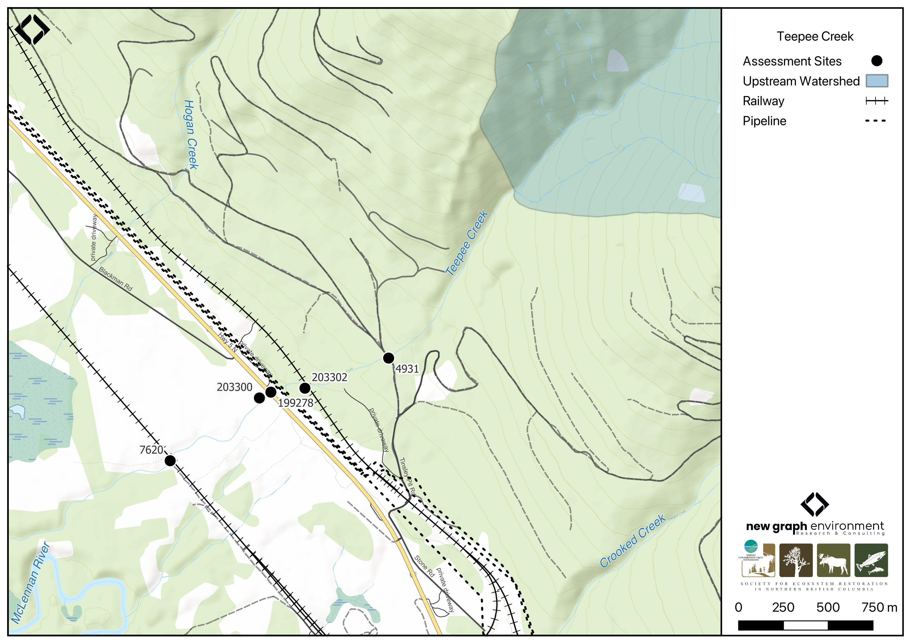

```{r setup-199278, eval = F}
knitr::opts_chunk$set(echo=FALSE, message=FALSE, warning=FALSE)
source('scripts/packages.R')
source('scripts/tables.R')
source('scripts/functions.R')
```

```{r  load-data-199278}
my_site <- 199278
my_site2 <- 203302
```

`r fpr::fpr_appendix_title(site2 = my_site2)`


## Site Location {.unnumbered}

PSCIS crossings `r as.character(my_site)` and `r as.character(my_site2)` are located on `r fpr::fpr_my_pscis_info()`, which flows into the McLennan River approximately 7km north of Valemount, BC, in the Upper Fraser River watershed group (Figure \@ref(fig:map-199278)). Crossing `r as.character(my_site)` is located `r round(fpr::fpr_my_bcfishpass(col_pull = downstream_route_measure)*0.001, 1)`km upstream of the McLennan River, on `r fpr_my_pscis_info(col_pull = road_name, site = my_site)`, and is the responsibility of the Ministry of Transportation and Infrastructure (`chris_culvert_id`: `r fpr_my_pscis_info(dat = form_pscis_2024, col_pull = moti_chris_culvert_id, site = my_site)`). Approximately 300m upstream, PSCIS crossing `r as.character(my_site2)` is located on and is the responsibility of the CN Railway.

<br>

```{r map-199278, fig.cap = my_caption}
 my_caption <- "Map of Teepee Creek"
 
 
 
```

## Background {.unnumbered}

At PSCIS crossing `r as.character(my_site)`, `r fpr::fpr_my_pscis_info()` is a
`r fpr::fpr_my_bcfishpass() |>english::ordinal()` order stream and drains a high elevation watershed of approximately
`r fpr::fpr_my_wshd()`km^2^. The watershed ranges in elevation from
a maximum of `r fpr::fpr_my_wshd(col = 'elev_max')`m to
`r fpr::fpr_my_wshd(col = 'elev_site')`m near crossing `r as.character(my_site)` (Table
\@ref(tab:tab-wshd-199278)).

<br>

In 2023, crossing `r as.character(my_site)` was assessed with fish passage assessments and prioritized for follow-up due to the presence of high-value habitat and a salmon observation recorded upstream in the FISS database [@moe2024KnownBC]. A habitat confirmation assessment encompassing both crossings `r as.character(my_site)` and `r as.character(my_site2)` was conducted in 2024. 

<br>

Downstream of `r fpr_my_pscis_info(col_pull = road_name, site = my_site)` on the CN railway, PSCIS crossing 7620 was initially assessed in 2007, and upstream of the highway, PSCIS crossing 4931 was initially assessed by Cliff Jackman Contracting Ltd. in 2010 [@moe2023PSCISAssessments]. Both crossings were reassessed during the 2024 field visit.

<br>

As previously mentioned, a salmon observation from 2012 is documented upstream of Highway 5 in the FISS database [@moe2024KnownBC]. Additionally, in 2004, bull trout were captured upstream and downstream of crossing  `r as.character(my_site)` by Triton Environmental Consultants Ltd. [@manson2005Fishcollection]. 

<br>

<!-- <br> -->

<!-- A summary of habitat modelling outputs for the crossing are presented in Table -->
<!-- \@ref(tab:tab-culvert-bcfp-199278).  -->

<br>

```{r tab-wshd-199278, eval = T}
fpr::fpr_table_wshd_sum(site_id = my_site) |>
  fpr::fpr_kable(caption_text = paste0('Summary of derived upstream watershed statistics for PSCIS crossing ', my_site, '.'),
           footnote_text = 'Elev P60 = Elevation at which 60% of the watershed area is above',
           scroll = F)

```


```{r tab-culvert-bcfp-199278, eval = F}
fpr::fpr_table_bcfp(scroll = gitbook_on) 
```

<br>


## Stream Characteristics at Crossings `r as.character(my_site)` and `r as.character(my_site2)`  {.unnumbered}

At the time of the 2024 assessment, PSCIS crossing `r as.character(my_site)` on `r fpr_my_pscis_info(col_pull = road_name, site = my_site)` was un-embedded, non-backwatered and ranked as `r fpr::fpr_my_pscis_info(col_pull = barrier_result) |>stringr::str_to_lower()` to upstream fish passage according to the provincial protocol [@moe2011Fieldassessment] (Table \@ref(tab:tab-culvert-199278)). The culvert had a moderate 0.4m outlet drop.

<br>

PSCIS crossing  `r as.character(my_site2)` on the CN `r fpr_my_pscis_info(col_pull = road_name, site = my_site2)` was un-embedded, non-backwatered and ranked as a `r fpr::fpr_my_pscis_info(site = my_site2, col_pull = barrier_result) |>stringr::str_to_lower()` to upstream fish passage according to the provincial protocol
[@moe2011Fieldassessment] (Table \@ref(tab:tab-culvert-203302)). This culvert had a significant 0.75m outlet drop. 

<br>

In 2024, three other PSCIS crossings were assessed on Teepee Creek and can be found in `r if(gitbook_on){knitr::asis_output("[Appendix - Phase 1 Fish Passage Assessment Data and Photos]")}else(knitr::asis_output("[Attachment - Phase 1 Data and Photos](#attach-pdf-phase1-dat)"))` (Figure \@ref(fig:map-199278)). Approximately 700m downstream of `r fpr_my_pscis_info(col_pull = road_name, site = my_site)`, PSCIS crossing 7620 was located on the CN Railway. Although the crossing ranked was as barrier to upstream fish passage according to the provincial protocol [@moe2011Fieldassessment], the culvert was embedded, 100% backwatered, and was not a barrier to fish passage at the time of the survey. Roughly 70m downstream of Highway 5, there was a small bridge on private land (PSCIS 203300). Approximately 600m upstream of PSCIS crossing  `r as.character(my_site2)` on the CN Railway, PSCIS crossing 4931 was located on Mount Tinsley Pit Road, which falls under the road tenure of Carrier Lumber R13564. The culvert had a significant 1.3m outlet drop. 

<br>

At all crossings, the water temperature was `r fpr::fpr_my_habitat_info(loc = "ds", col_pull = 'temperature_c')`$^\circ$C,
pH was `r fpr::fpr_my_habitat_info(loc = "ds", col_pull = 'p_h')` and
conductivity was `r fpr::fpr_my_habitat_info(loc = "ds", col_pull = 'conductivity_m_s_cm')` uS/cm.

`r if(identical(gitbook_on, FALSE)){knitr::asis_output("\\pagebreak")}`

<br>

```{r tab-culvert-199278, eval = T}
# fpr::fpr_table_cv_summary_memo()

# See issue https://github.com/NewGraphEnvironment/mybookdown-template/issues/65
fpr_table_cv_summary_memo_test()

```

<br>

```{r tab-culvert-203302, eval = T}
# fpr::fpr_table_cv_summary_memo(site = my_site2, site_photo_id = my_site2)

# See issue https://github.com/NewGraphEnvironment/mybookdown-template/issues/65
fpr_table_cv_summary_memo_test(site = my_site2, site_photo_id = my_site2)
```


<br>

```{r eval=F}
##this is useful to get some comments for the report
hab_site |>filter(site == my_site & location == 'ds') |>pull(comments)
hab_site |>filter(site == my_site & location == 'us') |>pull(comments)
hab_site |>filter(site == my_site2 & location == 'us') |>pull(comments)

```


## Stream Characteristics Downstream of Crossing `r as.character(my_site)` {.unnumbered}

`r fpr_my_survey_dist(loc = 'ds')` `r if(gitbook_on){knitr::asis_output("(Figure \\@ref(fig:photo-199278-01)).")}else(knitr::asis_output("(Figure \\@ref(fig:photo-199278-d01))."))`. The habitat was rated as `r fpr::fpr_my_priority_info(loc = 'ds') |>stringr::str_to_lower()` value, with  with frequent pools 0.3–0.5m deep suitable for overwintering fish and abundant gravels for spawning. `r fpr_my_habitat_paragraph(loc = 'ds')`. Roughly 150m downstream of the culvert, several cattle pens crossed the stream and appeared to be set up to provide cattle access for drinking. These areas were visibly trampled, with significant loss of riparian vegetation.

<br>

## Stream Characteristics Upstream of Crossing `r as.character(my_site)` and Downstream of Crossing `r as.character(my_site2)` {.unnumbered}

The stream was surveyed upstream from crossing `r as.character(my_site)` on `r fpr_my_pscis_info(col_pull = road_name, site = my_site)` to crossing `r as.character(my_site2)` on the CN Railway, a distance of approximately 300m `r if(gitbook_on){knitr::asis_output("(Figure \\@ref(fig:photo-199278-02)).")}else(knitr::asis_output("(Figure \\@ref(fig:photo-199278-d01)"))` The habitat was rated as `r fpr::fpr_my_priority_info(loc = 'us') |>stringr::str_to_lower()` value for spawning and rearing, with frequent deep pools formed by boulders and large woody debris, but only limited pockets of unembedded gravels. Numerous small steps ranging from 30–60cm were present due to the steep, boulder-dominated nature of the stream. `r fpr_my_habitat_paragraph(loc = 'us')`

<br>

## Stream Characteristics Upstream of Crossing `r as.character(my_site2)` {.unnumbered}

`r fpr_my_survey_dist(sit = my_site2, loc = 'us')` `r if(gitbook_on){knitr::asis_output("(Figure \\@ref(fig:photo-203302-01)).")}else(knitr::asis_output("(Figure \\@ref(fig:photo-203302-d01))."))` The habitat was rated as `r fpr::fpr_my_priority_info(sit = my_site2, loc = 'us') |> stringr::str_to_lower()` value for spawning and rearing, with few unembedded gravels; however, recent heavy rain caused slight turbidity making it difficult to assess the subtrate. `r fpr_my_habitat_paragraph(sit = my_site2, loc = 'us')` Approximately 100m before the end of the site, the stream showed signs of a large disturbance event that had incised the channel to a depth of 1.2–2m, with major areas of aggregation where the channel was widened and uniform.

<br>

## Structure Remediation and Cost Estimate {.unnumbered}

Should restoration/maintenance activities proceed, replacement of the `r fpr_my_pscis_info(col_pull = road_name)` crossing (`r as.character(my_site)`) with a bridge (`r fpr::fpr_my_pscis_info( col_pull = recommended_diameter_or_span_meters)` m span) is recommended. At the time of reporting in 2025, the cost of the work is estimated at \$ `r format(fpr::fpr_my_cost_estimate(), big.mark = ',')`.

<br>

Should restoration/maintenance activities proceed, replacement of the `r fpr_my_pscis_info(col_pull = road_name, site = my_site2)` crossing (`r as.character(my_site2)`) with a bridge (`r fpr::fpr_my_pscis_info(site = my_site2, col_pull = recommended_diameter_or_span_meters)` m span) is recommended. At the time of reporting in 2025, the cost of the work is estimated at \$ `r format(fpr::fpr_my_cost_estimate(site = my_site2), big.mark = ',')`.

<br>


## Conclusion {.unnumbered}

PSCIS crossing `r as.character(my_site)` on Highway 5 had a moderate 0.4m outlet drop that could be substantial at lower flows. A large, deep outlet pool indicated the culvert was likely undersized for the stream, and minimal road fill made this crossing a significant flood hazard, which could wash out Highway 5. The crossing is a `r stringr::str_to_lower(fpr::fpr_my_priority_info(col_pull = priority))` priority for replacement. Further upstream, PSCIS crossing `r as.character(my_site2)` on the CN Railway had a significant 0.75m outlet drop, likely inhibiting fish passage. This crossing is a `r stringr::str_to_lower(fpr::fpr_my_priority_info(sit = my_site2, col_pull = priority))` priority for replacement. 

<br>

Bull trout captured upstream and downstream of the crossing in 2004, along with a salmon observation documented upstream of Highway 5 in 2012 [@manson2005Fishcollection: @moe2024KnownBC], indicate that this stream provides valuable fish habitat. Given the species present in the system and the outlet drops at both crossings, fish sampling is recommended to assess whether the culverts are impeding fish passage.


`r if(gitbook_on){knitr::asis_output("<br>")} else knitr::asis_output("\\pagebreak")`

<br>

```{r tab-habitat-summary-199278, eval = T}
tab_hab_summary |>
  dplyr::filter(Site %in% c(my_site, my_site2)) |> 
  fpr::fpr_kable(caption_text = paste0("Summary of habitat details for PSCIS crossings ", my_site, " and ", my_site2, "."),
                 scroll = F) 

```

`r if(gitbook_on){knitr::asis_output("<br>")} else knitr::asis_output("\\pagebreak")`

```{r photo-199278-01-prep, eval=T}
my_photo1 = fpr::fpr_photo_pull_by_str(str_to_pull = 'ds_typical_1_')

my_caption1 = paste0('Typical habitat downstream of PSCIS crossing ', my_site, '.')


```

```{r photo-199278-01, fig.cap= my_caption1, out.width = photo_width, eval=gitbook_on}
knitr::include_graphics(my_photo1)
```

<br>

```{r photo-199278-02-prep, eval=T}
my_photo2 = fpr::fpr_photo_pull_by_str(str_to_pull = 'us_typical_1_')

my_caption2 = paste0('Typical habitat upstream of PSCIS crossing ', my_site, ' and downstream of PSCIS crossing ', my_site2, '.')


```

```{r photo-199278-02, fig.cap= my_caption2, out.width = photo_width, eval=gitbook_on}
knitr::include_graphics(my_photo2)
```

```{r photo-199278-d01, fig.cap = my_caption, fig.show="hold", out.width= c("49.5%","1%","49.5%"), eval=identical(gitbook_on, FALSE)}
my_caption <- paste0('Left: ', my_caption1, ' Right: ', my_caption2)

knitr::include_graphics(my_photo1)
knitr::include_graphics("fig/pixel.png")
knitr::include_graphics(my_photo2)
```

<br>

```{r photo-203302-01-prep, eval=T}
my_photo1 = fpr::fpr_photo_pull_by_str(site = my_site2, str_to_pull = 'us_typical_1_')

my_caption1 = paste0('Typical habitat upstream of PSCIS crossing ', my_site2, '.')


```

```{r photo-203302-01, fig.cap= my_caption1, out.width = photo_width, eval=gitbook_on}
knitr::include_graphics(my_photo1)
```

```{r photo-203302-d01, fig.cap = my_caption, fig.show="hold", out.width= c("49.5%","1%","49.5%"), eval=identical(gitbook_on, FALSE)}
my_caption <- paste0('Left: ', my_caption1, ' Right: ', my_caption2)

knitr::include_graphics(my_photo1)
knitr::include_graphics("fig/pixel.png")
knitr::include_graphics(my_photo2)
```
